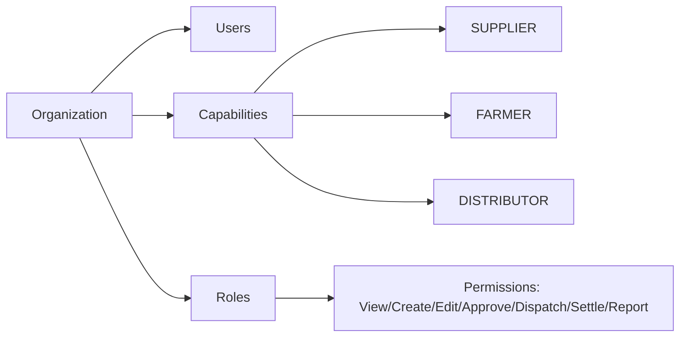
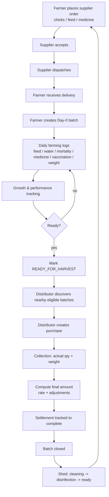

# 01 — Product Overview

KukkuOne is a B2B poultry-management SaaS ERP. It connects the three parties in a
broiler production loop — **Supplier → Farmer → Distributor** — around a single
source of truth: the **batch**. This document defines the product vision, the
actor/capability model, MVP scope, the end-to-end flow, the three dashboards, and
the acceptance criteria the MVP must satisfy.

Related docs: [System Architecture](02-System-Architecture.md) ·
[Farmer Module Spec](07-Farmer-Module-Spec.md) ·
[Admin Panel Spec](08-Admin-Panel-Spec.md) ·
[Client Apps Spec (Web + Mobile)](09-Client-Apps-Spec.md) ·
[Roadmap & Milestones](13-Roadmap-And-Milestones.md)

---

## 1. Product Vision

Poultry farming runs on tight biological and financial margins: a few days of
uncontrolled mortality, a missed vaccination, or an unrecorded feed cost can turn
a profitable batch into a loss. Today most of this is tracked in notebooks,
WhatsApp messages, and spreadsheets that never reconcile.

KukkuOne makes the **batch** the unit of truth. Every chick placement, feed bag,
dose of medicine, weight reading, mortality event, sale, and settlement is
attached to a batch and time-stamped. From that single ledger the platform can
answer, for each actor, three questions:

- **What happened?** (history and per-batch economics)
- **What needs attention today?** (alerts and due tasks)
- **What next?** (the next action in the loop)

The **Farmer ERP is the central engine and is built first.** Supplier and
distributor capabilities plug into the same batch ledger — they are not separate
products.

---

## 2. The Three Actors + Capability Model

KukkuOne models **Organizations**, not "user types." An organization holds one or
more **Capabilities**. Business behaviour is driven by the capabilities an org
holds, never by a hard-coded org-to-type mapping.

| Actor | Capability | Core responsibility in the loop |
|-------|-----------|---------------------------------|
| Supplier | `SUPPLIER` | Receives orders for chicks/feed/medicine, accepts, dispatches, invoices |
| Farmer | `FARMER` | Orders inputs, runs batches from Day 0 to harvest, records daily farming |
| Distributor | `DISTRIBUTOR` | Discovers ready batches, purchases, collects birds, settles payment |

**Capability model rules:**

- An `Organization` **may hold multiple capabilities** (e.g. an org that both
  supplies chicks and supplies feed, or a farmer org that also distributes).
- Each org has **Users**, **Roles**, and **Permissions**. Permission actions are:
  **View, Create, Edit, Approve, Dispatch, Settle, Report.**
- Never hard-code one org to one business type. Feature access is resolved from
  (capability held) × (role permission). See [Auth & RBAC](05-Auth-And-RBAC.md).

---

## 3. MVP Scope

### 3.1 In Scope — the full loop

The MVP delivers the **complete production loop end to end**:

1. Farmer places a **supplier order** (chicks / feed / medicine).
2. Supplier **accepts** and **dispatches**.
3. Farmer **receives** the delivery.
4. Farmer creates a **Day-0 batch**.
5. Farmer runs **daily farming logs** (feed, water, mortality, medicine, vaccination, weight).
6. System tracks **growth / performance** per batch.
7. Farmer marks batch **READY_FOR_HARVEST**.
8. Distributor **discovers** nearby eligible batches.
9. Distributor creates a **purchase**.
10. **Collection** records actual quantity + weight.
11. System computes **final amount** (rate, adjustments).
12. **Settlement** is tracked to completion.
13. Batch is **closed**.
14. Shed moves **cleaning → disinfection → ready**.
15. Farmer starts the **next batch**.

### 3.2 Out of Scope (extension points — must remain open, none required for MVP)

The architecture must leave clean seams for these; they are **not** built in MVP:

| Extension point | What it later adds |
|-----------------|--------------------|
| Buyers / Processors | Downstream processing/plants as first-class buyers |
| Charter / Trader | Contract-farming and trader intermediaries |
| Logistics | Managed transport, routing, fleet |
| Finance | Credit lines, financing, invoicing beyond settlement |
| Marketplace | Open discovery/bidding across many orgs |
| Intelligence | Predictive growth, price, and disease analytics |

These must remain **pluggable** — new capabilities, services, or modules added
without refactoring the farmer-first core.

---

## 4. End-to-End Business Flow

---

## 5. The Three Dashboards

Every actor gets a dashboard framed by the same three guiding questions.

| Guiding question | Purpose |
|------------------|---------|
| **What happened?** | Historical record and per-batch/per-order economics |
| **What needs attention today?** | Actionable alerts and due tasks |
| **What next?** | The next step in the loop for this actor |

### Per-actor alerts

| Actor | Alerts |
|-------|--------|
| **Farmer** | Mortality increase · Low feed · Low medicine · Vaccination due · Harvest approaching · Settlement pending |
| **Supplier** | New order · Dispatch due · Delivery confirmed · Overdue invoice · Payment received |
| **Distributor** | New ready batch · Purchase accepted · Collection due · Settlement pending/overdue |

---

## 6. MVP Acceptance Criteria

The MVP is accepted when all ten hold:

1. A farmer can **order chicks/feed** and follow it through **dispatch and receipt**.
2. A farmer can **create a Day-0 batch** and run **daily logs through to harvest**.
3. The system keeps **bird count, feed, health, growth, and cost per batch**.
4. A farmer can mark a batch **READY_FOR_HARVEST**.
5. A distributor can **discover nearby eligible batches** and **create a purchase**.
6. A purchase records **actual quantity, weight, rate, adjustments, and final amount**.
7. A distributor can **track settlement status and history**.
8. A batch **closes after sale/settlement**, and the shed moves **cleaning → disinfection → ready**.
9. The **same org can be both a chick supplier and a feed supplier**.
10. All records carry **status, timestamps, org-ownership, and audit**.

---

## 7. MVP Success Definition

The MVP succeeds when KukkuOne runs a **reliable, complete loop** —
**supplier → farmer → distributor → settlement → next batch** — with every record
attached to a batch, owned by an org, time-stamped, and auditable, so each actor's
dashboard can truthfully answer *what happened, what needs attention today,* and
*what next.*
