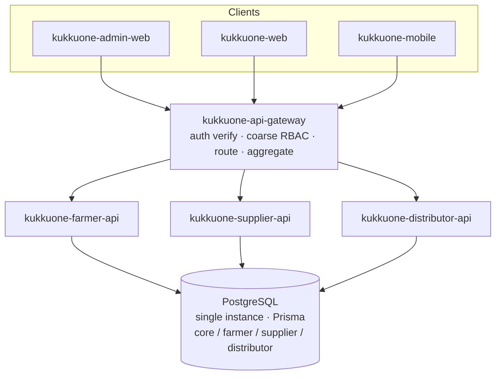
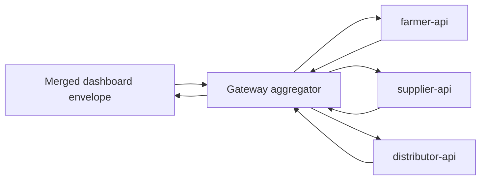
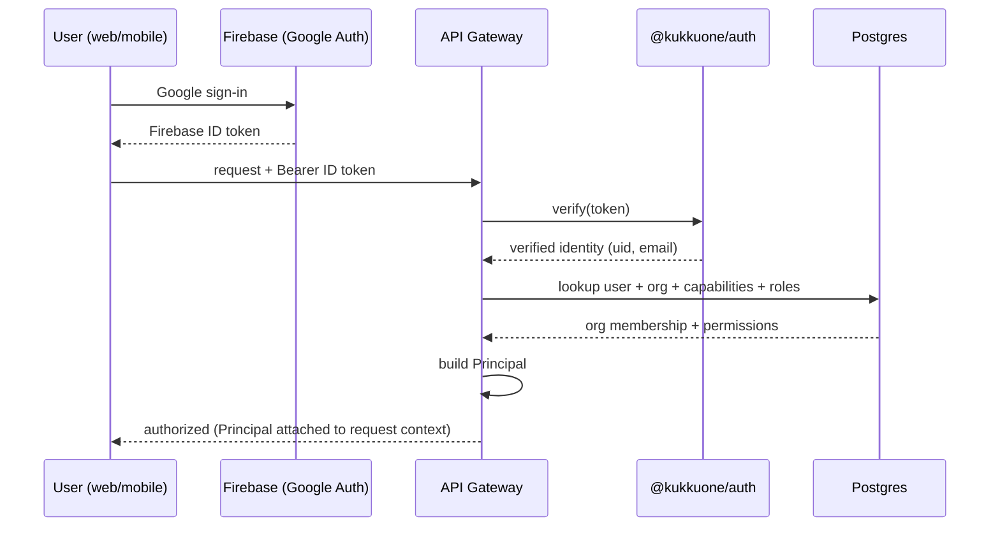
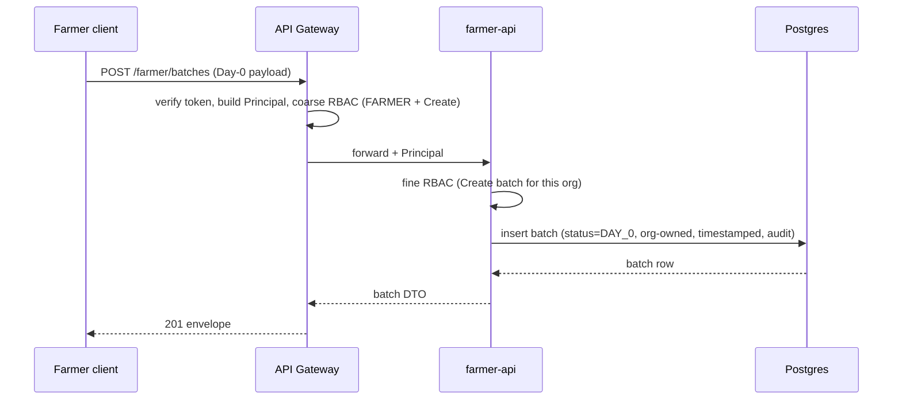

# 02 — System Architecture

KukkuOne is a monorepo (pnpm + Turborepo). Clients talk to a single **API Gateway**
that verifies auth, applies coarse RBAC, routes and aggregates, and fronts three
NestJS services — **farmer**, **supplier**, **distributor** — over **one shared
PostgreSQL** instance accessed through Prisma.

Related docs: [Repository Structure](04-Repository-Structure.md) ·
[Auth & RBAC](05-Auth-And-RBAC.md) ·
[Data Model](06-Data-Model.md) ·
[API Conventions](12-API-Conventions.md)

---

## 1. High-Level Diagram



All services share **one `DATABASE_URL`**. The database is partitioned **logically**
by module (core, farmer, supplier, distributor) — one instance, one schema managed
by `@kukkuone/db`. See [Data Model](06-Data-Model.md).

---

## 2. Component Responsibility Matrix

| Component | Owns | Does NOT own |
|-----------|------|--------------|
| **kukkuone-api-gateway** | Auth token verification, internal Principal construction, coarse RBAC (capability/role gate), routing, cross-service aggregation for dashboards, request/response envelope | Business rules, fine-grained per-record permission, DB writes |
| **kukkuone-farmer-api** | Batches, daily logs, growth/performance, harvest state, shed lifecycle, farmer input orders | Auth verification, supplier/distributor internals |
| **kukkuone-supplier-api** | Supplier orders (accept/dispatch), invoices, payments-in | Auth verification, farmer/distributor internals |
| **kukkuone-distributor-api** | Batch discovery, purchases, collection, settlement | Auth verification, farmer/supplier internals |
| **@kukkuone/auth** | AuthProvider interface + Firebase adapter, token verify, Principal shape | Business authorization decisions |
| **@kukkuone/db** | Prisma schema, migrations, seed, client | Service business logic |
| **@kukkuone/types** | Shared DTOs, enums, Principal, envelope types | Runtime logic |
| **@kukkuone/api-client** | Typed client used by web/mobile against the gateway | Server logic |
| **@kukkuone/config** | Env loading/validation | Secrets storage |
| **@kukkuone/ui** | Shared React/AntD components | Domain data |

---

## 3. Request Lifecycle

```
Client
  │  1. obtain Firebase ID token (Google Auth)
  ▼
API Gateway
  │  2. verify token via @kukkuone/auth (AuthProvider adapter)
  │  3. build internal Principal { userId, orgId, capabilities[], roles[], permissions[] }
  │  4. coarse RBAC — is this Principal allowed to touch this capability/route at all?
  │  5. route to the owning service (farmer / supplier / distributor)
  ▼
Service (NestJS)
  │  6. fine RBAC — action-level check (View/Create/Edit/Approve/Dispatch/Settle/Report)
  │     against the specific record + org ownership
  │  7. Prisma query/mutation
  ▼
PostgreSQL (shared instance)
```

- **Token → Principal** mapping happens **only at the gateway**. Downstream services
  trust the internal Principal passed by the gateway (internal-only network hop).
- **Coarse RBAC** at the gateway is a cheap capability/route gate. **Fine RBAC** at the
  service checks the concrete action against the concrete record and org ownership.
  See [Auth & RBAC](05-Auth-And-RBAC.md).

### 3.1 Cross-Service Dashboard Aggregation

Dashboards ("what happened / attention today / what next") need data spanning
services. The **gateway aggregates**: it fans out to farmer/supplier/distributor
services in parallel, merges responses into one dashboard payload, and returns a
single envelope. Services never call each other directly.



---

## 4. Cross-Cutting Concerns (as shared packages)

| Concern | Home | Contract |
|---------|------|----------|
| **Auth** | `@kukkuone/auth` | `AuthProvider` interface; default Firebase adapter; swap via `AUTH_PROVIDER` env |
| **Org / RBAC** | `@kukkuone/types` + gateway/service guards | Principal shape, capability + permission enums |
| **Notifications** | shared package (alerts feed) | Per-actor alert events emitted by services, surfaced on dashboards |
| **Audit** | `@kukkuone/db` + service interceptors | Every write stamps actor, org, timestamp, before/after |

Keeping these in shared packages guarantees every service enforces the **same**
auth, RBAC, and audit rules.

---

## 5. Sequence Diagrams

### (a) Google login → token verification → Principal mapping



### (b) Day-0 batch creation



### (c) Distributor purchase → actual collection → settlement

```mermaid
sequenceDiagram
  participant D as Distributor client
  participant GW as API Gateway
  participant DA as distributor-api
  participant DB as Postgres

  D->>GW: POST /distributor/purchases (batchId)
  GW->>DA: forward + Principal (coarse RBAC: DISTRIBUTOR + Create)
  DA->>DB: create purchase (status=CREATED)
  DB-->>DA: purchase row
  DA-->>GW: purchase DTO
  D->>GW: POST /distributor/purchases/:id/collection (actual qty + weight)
  GW->>DA: forward + Principal
  DA->>DB: record collection, compute final (rate + adjustments)
  DB-->>DA: updated purchase
  D->>GW: POST /distributor/purchases/:id/settle
  GW->>DA: forward + Principal (Settle permission)
  DA->>DB: settlement status -> SETTLED; signal batch close
  DB-->>DA: settled
  DA-->>GW: settlement DTO
  GW-->>D: envelope
```

---

## 6. Why Shared DB Now, Split Later

**Now:** one PostgreSQL instance, one `DATABASE_URL`, logical module partitioning.
This keeps referential integrity across the loop (a purchase referencing a batch),
simplifies migrations and local setup, and avoids premature distributed-data
complexity while the schema is still moving.

**Documented split path (per service, when needed):**

1. Modules are already logically partitioned (core/farmer/supplier/distributor), so
   ownership boundaries are clear.
2. Replace direct cross-module reads with service-to-service reads via the gateway.
3. Carve the target module's tables into a new database + `DATABASE_URL_<module>`.
4. Point that service's Prisma client at the new URL; keep the rest shared.
5. Repeat per service. No client change — the gateway contract is unchanged.

---

## 7. Scaling Path

The folders are **already isolated** (separate NestJS apps + shared packages), so
each of these is a deployment change, not a rewrite:

| Step | Action |
|------|--------|
| Extract service | Deploy farmer/supplier/distributor-api as independent processes |
| Extract DB | Split a module to its own DB (Section 6) |
| Deploy independently | Scale the hot service horizontally behind the gateway |
| Host anywhere | Same env contract (Railway/Render/Fly/VPS), Docker Compose locally |

See [Repository Structure](04-Repository-Structure.md),
[Auth & RBAC](05-Auth-And-RBAC.md), [Data Model](06-Data-Model.md), and
[API Conventions](12-API-Conventions.md).
