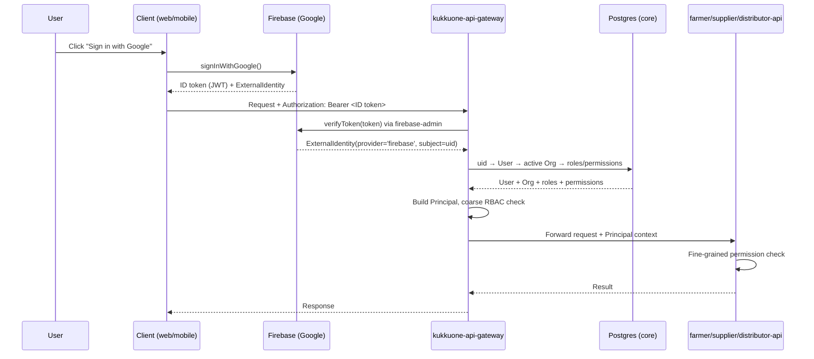
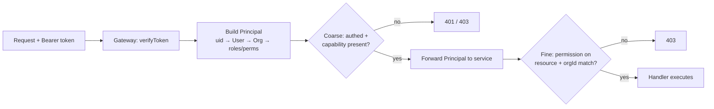

# 05 — Auth & RBAC

KukkuOne treats authentication as a **swappable layer** and authorization as an
**org-scoped, capability-gated** concern that every service enforces. The identity
provider (Firebase Google by default) never leaks into business code — all modules
depend on one internal `Principal` type. Swapping providers is an adapter + env
change, nothing more.

Related docs: [System Architecture](02-System-Architecture.md) ·
[Data Model](06-Data-Model.md) ·
[Client Apps Spec](09-Client-Apps-Spec.md) ·
[API Conventions](12-API-Conventions.md)

---

## 1. Goals

| Goal | How it is met |
|------|---------------|
| **Pluggable auth** | Entire identity layer sits behind an `AuthProvider` contract; swap by adapter + `AUTH_PROVIDER` env, zero business-code changes |
| **Firebase Google default** | Client uses Firebase JS SDK for Google sign-in; gateway verifies via `firebase-admin` |
| **Org-scoped RBAC** | Every business row carries `orgId`; roles/permissions are resolved **per organization**, enforced on every request |
| **Capability gating** | An org holds one or more capabilities (Farmer/Distributor/Supplier); features render and endpoints authorize against the org's capability set |
| **Provider-agnostic identity** | External identities are stored as `ExternalIdentity(provider, subject)` rows — `firebase_uid` is just one row, not a schema assumption |

---

## 2. The `AuthProvider` contract

The auth layer is split into a **client** contract (used by `kukkuone-web`,
`kukkuone-admin-web`, `kukkuone-mobile`) and a **server** contract (used by the
gateway only). Both live in `@kukkuone/auth`.

```ts
// @kukkuone/auth — provider-agnostic contracts

/** Raw identity returned by an external IdP after verifying a token. */
export interface ExternalIdentity {
  provider: string;        // 'firebase' | 'auth0' | 'cognito' | 'custom-jwt'
  subject: string;         // provider's stable user id (e.g. firebase_uid)
  email?: string;
  emailVerified?: boolean;
  displayName?: string;
  photoUrl?: string;
}

/** CLIENT side — what the apps call. Implemented per provider. */
export interface AuthClient {
  signInWithGoogle(): Promise<ExternalIdentity>;
  signOut(): Promise<void>;
  getIdToken(forceRefresh?: boolean): Promise<string | null>;
  onAuthStateChanged(cb: (identity: ExternalIdentity | null) => void): () => void; // returns unsubscribe
}

/** SERVER side — what the gateway calls. Implemented per provider. */
export interface AuthServer {
  verifyToken(token: string): Promise<ExternalIdentity>; // throws on invalid/expired
}
```

### 2.1 The internal `Principal` (what business code depends on)

After the gateway verifies a token and resolves the identity to an application user,
it builds a `Principal`. **Every service, guard, and business module consumes this
type — never a Firebase or provider type.**

```ts
// @kukkuone/types — the ONLY identity type business code sees
export type Capability = 'FARMER' | 'DISTRIBUTOR' | 'SUPPLIER';
export type PermissionAction =
  | 'View' | 'Create' | 'Edit' | 'Approve' | 'Dispatch' | 'Settle' | 'Report';

export interface Principal {
  userId: string;               // KukkuOne User.id (uuid) — NOT the provider subject
  orgId: string;                // active organization for this request
  capabilities: Capability[];   // capabilities the active org holds
  roles: string[];              // role keys within the active org (e.g. 'FARMER_OWNER')
  permissions: string[];        // resolved permission keys (e.g. 'batch:Approve')
  isSuperAdmin?: boolean;       // env allowlist match (see §8)
}
```

> The gateway attaches the `Principal` to the request context and forwards it to
> downstream services as signed headers / propagated context. Services trust the
> gateway boundary and re-check **fine-grained** permissions locally (see §7).

---

## 3. Firebase adapter (default)

The default `AUTH_PROVIDER=firebase` wires two implementations:

| Contract | Implementation | Library |
|----------|----------------|---------|
| `AuthClient` | `FirebaseAuthClient` | Firebase JS SDK (`firebase/auth`) |
| `AuthServer` | `FirebaseAuthServer` | `firebase-admin` |

**Resolution chain** at the gateway (token → Principal):

```
firebase_uid (token.subject)
  → ExternalIdentity(provider='firebase', subject=firebase_uid)
  → User (via Membership on ExternalIdentity → User)
  → Organization (active org)
  → Roles + Permissions (org-scoped)
  → Principal
```

### 3.1 Token flow



---

## 4. Onboarding & capability selection

On first Google sign-in the user has an identity but **no organization**. Onboarding
creates the org, lets the user pick **any/all** capabilities, and assigns the owner
role. The app then routes to the matching experience.

```mermaid
flowchart TD
  A[Google sign-in] --> B{Known ExternalIdentity?}
  B -- yes --> C[Load User + memberships]
  B -- no --> D[Create User + ExternalIdentity]
  D --> E[Onboarding screen]
  C --> F{Has an Organization?}
  F -- yes --> J[Route to experience]
  F -- no --> E
  E --> G[Create Organization<br/>name, currency]
  G --> H[Select capabilities:<br/>Farmer / Distributor / Supplier — any/all]
  H --> I[Persist Organization.capabilities[]<br/>+ assign OWNER role per capability]
  I --> J{How many capabilities?}
  J -- one --> K[Render single experience]
  J -- many --> L[Render actor switcher<br/>Farmer / Distributor / Supplier]
```

**Steps:**

1. **Google sign-in** returns an `ExternalIdentity`.
2. If the `subject` is unknown, create a `User` + `ExternalIdentity` row.
3. If the user has no org, show the **onboarding screen**.
4. User creates an **Organization** (name, base currency).
5. User selects **capabilities** — any subset of `{Farmer, Distributor, Supplier}`.
6. Persist `Organization.capabilities[]`; assign the user the **Owner** role for the
   selected capabilities via a `Membership`.
7. App routes: one capability → that experience directly; multiple → **actor
   switcher** so the user toggles the active capability (which sets `Principal.capabilities`
   context for the session).
8. **Capabilities are editable later** by an org Owner (add/remove a capability;
   removal is soft — historical rows are retained, the experience is hidden).

> The Farmer ERP is built first, so a Farmer-only org is the primary onboarding path.
> See [Client Apps Spec](09-Client-Apps-Spec.md) for the actor-switcher UI.

---

## 5. Swap strategy (provider-agnostic)

To move off Firebase (to Auth0, Cognito, or a custom JWT issuer):

1. Implement a new adapter pair — `Auth0AuthClient` / `Auth0AuthServer` — satisfying
   the same `AuthClient` / `AuthServer` contracts.
2. Set `AUTH_PROVIDER=auth0` (plus that provider's env — see
   [Environment & Config](10-Environment-And-Config.md)).
3. **Change nothing** in the business modules — they only ever see `Principal`.

The identity linkage survives the swap because external identities are stored
provider-agnostically:

```
ExternalIdentity(provider='firebase', subject='uid-abc', userId=U1)   ← today
ExternalIdentity(provider='auth0',    subject='auth0|xyz', userId=U1) ← after migration
```

A user can even carry **multiple** `ExternalIdentity` rows (one per provider) mapped
to the same `User`, which enables a zero-downtime provider migration.

| Provider | `AUTH_PROVIDER` | Client lib | Server verify |
|----------|-----------------|-----------|----------------|
| Firebase (default) | `firebase` | Firebase JS SDK | `firebase-admin` |
| Auth0 | `auth0` | `@auth0/auth0-spa-js` | JWKS verify (`jose`) |
| Cognito | `cognito` | Amplify Auth | JWKS verify (`jose`) |
| Custom JWT | `custom-jwt` | app-issued | shared-secret / JWKS verify |

---

## 6. RBAC model

Authorization is **org-scoped** and **capability-scoped**. Roles are defined **per
capability**; the same user may hold different roles across capabilities/orgs.

### 6.1 Roles per capability

| Capability | Roles |
|------------|-------|
| **Supplier** | Owner · Manager · Operations · Finance |
| **Farmer** | Owner · Farm Manager · Farm Operator · Accountant |
| **Distributor** | Owner · Procurement Manager · Operations Manager · Finance Manager |

### 6.2 Permission actions

`View` · `Create` · `Edit` · `Approve` · `Dispatch` · `Settle` · `Report`

Permissions are keyed `resource:Action` (e.g. `batch:Approve`, `dispatch:Dispatch`,
`settlement:Settle`).

### 6.3 Coarse vs fine enforcement

| Tier | Where | Checks |
|------|-------|--------|
| **Coarse** | Gateway | Token valid? User active? Active org holds the **capability** the route targets? |
| **Fine** | Service | Does the `Principal` hold the specific **permission** on the resource, and does the resource's `orgId` match `Principal.orgId`? |

### 6.4 NestJS guard sketch (fine-grained, service side)

```ts
// @Permissions('batch:Approve') on a controller/handler
@Injectable()
export class PermissionsGuard implements CanActivate {
  constructor(private reflector: Reflector) {}

  canActivate(ctx: ExecutionContext): boolean {
    const required = this.reflector.getAllAndOverride<string[]>('permissions', [
      ctx.getHandler(), ctx.getClass(),
    ]) ?? [];
    if (required.length === 0) return true;

    const req = ctx.switchToHttp().getRequest();
    const principal: Principal = req.principal; // set from gateway-propagated context
    if (!principal) throw new UnauthorizedException();

    const ok = required.every((perm) => principal.permissions.includes(perm));
    if (!ok) throw new ForbiddenException(`Missing permission(s): ${required.join(', ')}`);
    return true;
  }
}

// Usage
@Post(':id/approve')
@Capabilities('FARMER')          // coarse hint, also enforced at gateway
@Permissions('batch:Approve')    // fine-grained
approve(@Param('id') id: string) { /* ... */ }
```

### 6.5 Permission matrix (example)

Farmer capability, `✓` = granted:

| Resource / Action | Owner | Farm Manager | Farm Operator | Accountant |
|-------------------|:-----:|:------------:|:-------------:|:----------:|
| `batch:View` | ✓ | ✓ | ✓ | ✓ |
| `batch:Create` | ✓ | ✓ | | |
| `batch:Approve` | ✓ | ✓ | | |
| `dailyLog:Create` | ✓ | ✓ | ✓ | |
| `harvest:Dispatch` | ✓ | ✓ | | |
| `settlement:Settle` | ✓ | | | ✓ |
| `report:Report` | ✓ | ✓ | | ✓ |

Distributor capability (illustrative):

| Resource / Action | Owner | Procurement Mgr | Operations Mgr | Finance Mgr |
|-------------------|:-----:|:---------------:|:--------------:|:-----------:|
| `purchase:Create` | ✓ | ✓ | | |
| `purchaseActuals:Edit` | ✓ | | ✓ | |
| `distributorSettlement:Settle` | ✓ | | | ✓ |

---

## 7. Request enforcement summary



See [API Conventions](12-API-Conventions.md) for error envelope shapes on 401/403.

---

## 8. Admin super-admin

The platform owner (`naptrixlabs@gmail.com`) is **not** part of the actor onboarding
flow — it is a cross-org operator of `kukkuone-admin-web`.

| Aspect | Behavior |
|--------|----------|
| Seeding | Matched against `ADMIN_SUPERUSER_EMAIL` env allowlist at token resolution |
| Marking | Sets `Principal.isSuperAdmin = true` |
| Scope | Full **cross-org read** access in `kukkuone-admin-web`; not bound to a single `orgId` |
| Onboarding | Skips org/capability onboarding entirely |
| Write access | Governed by the admin console's own admin permissions, audited (§9) |

```ts
principal.isSuperAdmin =
  ADMIN_SUPERUSER_EMAILS.includes(identity.email?.toLowerCase() ?? '');
```

See [Admin Panel Spec](08-Admin-Panel-Spec.md).

---

## 9. Session / token handling & security

| Concern | Approach |
|---------|----------|
| **Mobile session** | ID/refresh token stored in `expo-secure-store` (Keychain/Keystore) |
| **Web session** | Access token held **in memory**; silent refresh via provider SDK; no long-lived token in `localStorage` |
| **Gateway** | **Stateless** — verifies the token on **every** request; no server session store |
| **Token expiry** | Short-lived ID tokens; client refreshes via `getIdToken(true)`; gateway rejects expired tokens (401) |
| **Least privilege** | Roles grant the minimum actions; `Approve`/`Dispatch`/`Settle` are never bundled into operator roles by default |
| **Audit** | Every `Approve`, `Dispatch`, and `Settle` writes an `AuditLog` row (actor `userId`, `orgId`, resource, action, before/after) — see [Data Model](06-Data-Model.md) |
| **Org isolation** | All queries filter by `Principal.orgId`; resource `orgId` mismatch = 403 |
| **Super-admin** | Cross-org reads are logged; write actions require explicit admin permissions |

---

Related: [System Architecture](02-System-Architecture.md) ·
[Data Model](06-Data-Model.md) ·
[Client Apps Spec](09-Client-Apps-Spec.md) ·
[API Conventions](12-API-Conventions.md)
