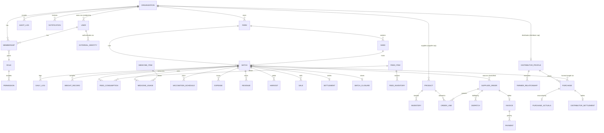

# 06 — Data Model

KukkuOne runs on **one PostgreSQL instance** accessed through **Prisma**, logically
partitioned into four modules — **core**, **farmer**, **supplier**, **distributor**.
The **Batch** entity in the farmer partition is central: the whole supplier→farmer→
distributor loop hangs off it. One physical database keeps referential integrity and
migrations simple; the partitions mark the seams for a future split (see
[System Architecture](02-System-Architecture.md) §6).

Related docs: [Auth & RBAC](05-Auth-And-RBAC.md) ·
[Farmer Module Spec](07-Farmer-Module-Spec.md) ·
[System Architecture](02-System-Architecture.md) ·
[API Conventions](12-API-Conventions.md)

---

## 1. Overview & conventions

| Convention | Rule |
|------------|------|
| **Primary keys** | `uuid` (`@id @default(uuid())`) |
| **Timestamps** | `createdAt @default(now())`, `updatedAt @updatedAt` on every row |
| **Authorship** | `createdBy` (User id) on business rows; `updatedBy` where edits matter |
| **Org ownership** | `orgId` on **every business row**; all queries filter by the active org |
| **Soft delete** | `deletedAt DateTime?` where history matters (batches, orders, products) |
| **Money** | Integer **minor units** (`Int`/`BigInt`) + `currency` (ISO-4217 `String`). Never floats |
| **Quantities/weights** | Integers in a fixed unit — birds as counts, weights in **grams**, feed in **grams** (bags tracked separately) |
| **Status** | Postgres `enum` types matching the lifecycle enums (see below) |
| **Audit** | `AuditLog` captures every `Approve`/`Dispatch`/`Settle` and sensitive edit |
| **Notification** | `Notification` rows drive in-app/push alerts |
| **Logical partition** | Model names are grouped by module; Prisma `@@schema` may map to Postgres schemas `core`/`farmer`/`supplier`/`distributor` when multi-schema is enabled |

**Lifecycle enums** (authoritative — mirrored from the product spec):

- **SupplierOrder**: `DRAFT → SUBMITTED → RECEIVED → ACCEPTED → PROCESSING →
  READY_FOR_DISPATCH → DISPATCHED → RECEIVED → INVOICED → SETTLED`
- **Shed**: `EMPTY → PREPARING → READY → OCCUPIED/RUNNING → HARVESTING → CLEANING →
  DISINFECTION → READY`
- **Batch**: `PLANNED → PLACED → ACTIVE → READY_FOR_HARVEST → HARVESTING → SOLD →
  SETTLEMENT_PENDING → SETTLED → CLOSED`
- **Payment**: `PENDING → PARTIALLY_PAID → PAID → OVERDUE → CANCELLED`
- **Vaccination**: `SCHEDULED → DUE → COMPLETED`

---

## 2. ERD



---

## 3. core entities

| Entity | Purpose | Key fields |
|--------|---------|-----------|
| **Organization** | Tenant; holds capabilities | `name`, `capabilities[]` (Capability enum), `baseCurrency`, `status` |
| **User** | A person; provider-agnostic | `email`, `displayName`, `photoUrl`, `status` |
| **ExternalIdentity** | IdP linkage, one per provider | `provider`, `subject`, `userId` (unique on `provider+subject`) |
| **Membership** | user ↔ org with role + capability scope | `userId`, `orgId`, `roleId`, `capabilityScope` (Capability) |
| **Role** | Named role within a capability | `key`, `name`, `capability`, `orgId?` (null = template) |
| **Permission** | `resource:Action` grant on a role | `roleId`, `resource`, `action` (PermissionAction) |
| **Capability** | Enum, not a table | `FARMER` `DISTRIBUTOR` `SUPPLIER` |
| **AuditLog** | Immutable action trail | `orgId`, `actorUserId`, `resource`, `resourceId`, `action`, `before`, `after`, `at` |
| **Notification** | In-app/push alerts | `orgId`, `userId?`, `type`, `title`, `body`, `readAt?`, `payload` |

---

## 4. farmer entities

| Entity | Purpose | Key fields |
|--------|---------|-----------|
| **Farm** | Physical farm site | `name`, `location`, `orgId` |
| **Shed** | Housing unit, lifecycle-tracked | `code`, `capacity`, `status` (Shed enum) |
| **Batch** | **CENTRAL** grow-out cycle | `farmId`, `shedId`, `chickSupplierId`, `breed`, `placementDate`, `targetHarvestDate`, `initialBirds`, `mortality`, `culls`, `birdsSold`, `status` (Batch enum) |
| **DailyLog** | Per-day operational record | `date`, `openingBirds`, `mortality`, `culls`, `closingBirds`, `weightSampleQty`, `avgWeight`, `minWeight`, `maxWeight`, `uniformity`, `feedType`, `feedConsumed`, `water`, `medicineNotes`, `tempC`, `humidity`, `notes` |
| **WeightRecord** | Sampled weight events | `date`, `sampleQty`, `avgWeight`, `minWeight`, `maxWeight`, `uniformity` |
| **FeedItem** | Feed catalog (starter/grower/finisher) | `type`, `brand`, `bagSizeKg` |
| **FeedInventory** | On-hand feed stock | `feedItemId`, `bags`, `kg`, `supplierId`, `unitCost` |
| **FeedConsumption** | Feed drawn per batch/day | `batchId`, `feedItemId`, `date`, `bags`, `kg`, `cost` |
| **MedicineItem** | Medicine catalog | `name`, `unit` |
| **MedicineUsage** | Medicine applied to a batch | `batchId`, `medicineItemId`, `date`, `qty`, `cost`, `notes` |
| **VaccinationSchedule** | Planned/administered vaccines | `batchId`, `vaccine`, `scheduledDate`, `status` (Vaccination enum), `completedDate?` |
| **Expense** | Cost line by category | `batchId`, `category` (chicks/feed/medicine/vaccination/labour/electricity/water/transport/other), `amount`, `currency`, `date` |
| **Revenue** | Income line by source | `batchId`, `source` (bird/manure/other), `amount`, `currency`, `date` |
| **Harvest** | Harvest event | `batchId`, `date`, `birdsHarvested`, `totalWeight` |
| **Sale** | Sale of harvested birds | `batchId`, `buyerId?`, `qty`, `weight`, `rate`, `amount`, `currency` |
| **Settlement** | Financial close of a batch's sales | `batchId`, `payable`, `paid`, `balance`, `status`, `date`, `reference` |
| **BatchClosure** | Final closure record | `batchId`, `closedAt`, `summaryMetrics` (jsonb), `closedBy` |

---

## 5. supplier entities

| Entity | Purpose | Key fields |
|--------|---------|-----------|
| **Product** | Chick or Feed sold | Chick: `breed`, `age`, `pricePerChick`, `qty`, `active`. Feed: `type`, `brand`, `bagSize`, `pricePerBag`, `qty`, `active` |
| **Inventory** | Stock levels per product | `productId`, `onHand`, `reserved` |
| **SupplierOrder** | Purchase order from a farmer | `buyerOrgId`, `status` (SupplierOrder enum), `subtotal`, `tax`, `discount`, `total`, `currency` |
| **OrderLine** | Line within an order | `orderId`, `productId`, `qty`, `unitRate`, `lineAmount`, `subtotal`, `tax`, `discount`, `total` |
| **Dispatch** | Shipment of an order | `orderId`, `number`, `vehicle`, `driver`, `dateTime`, `status` |
| **Invoice** | Bill for an order | `orderId`, `amount`, `paid`, `balance`, `status` (Payment enum) |
| **Payment** | Payment against an invoice | `invoiceId`, `amount`, `method`, `reference`, `date` |

---

## 6. distributor entities

| Entity | Purpose | Key fields |
|--------|---------|-----------|
| **DistributorProfile** | Distributor capability profile | `orgId`, `operatingArea` |
| **FarmerRelationship** | Distributor ↔ farmer link | `distributorProfileId`, `farmerOrgId`, `status` |
| **Purchase** | Order for a batch's harvest | `batchId`, `farmerOrgId`, `expectedQty`, `expectedWeight`, `rate`, `amount`, `currency` |
| **PurchaseActuals** | Reconciliation at collection | `purchaseId`, `actualBirds`, `rejects`, `liveWeight`, `rate`, `gross`, `adjustments`, `final` |
| **DistributorSettlement** | Financial close of a purchase | `purchaseId`, `payable`, `paid`, `balance`, `date`, `reference`, `status` (Payment enum) |

---

## 7. Prisma schema sketch

Full for **core** + **farmer**; abbreviated stubs for **supplier** + **distributor**.

```prisma
// ─────────────────────────── enums ───────────────────────────
enum Capability { FARMER DISTRIBUTOR SUPPLIER }

enum PermissionAction { View Create Edit Approve Dispatch Settle Report }

enum ShedStatus { EMPTY PREPARING READY OCCUPIED RUNNING HARVESTING CLEANING DISINFECTION }

enum BatchStatus {
  PLANNED PLACED ACTIVE READY_FOR_HARVEST HARVESTING SOLD
  SETTLEMENT_PENDING SETTLED CLOSED
}

enum SupplierOrderStatus {
  DRAFT SUBMITTED RECEIVED ACCEPTED PROCESSING READY_FOR_DISPATCH
  DISPATCHED DELIVERED INVOICED SETTLED
}

enum PaymentStatus { PENDING PARTIALLY_PAID PAID OVERDUE CANCELLED }

enum VaccinationStatus { SCHEDULED DUE COMPLETED }

enum FeedType { STARTER GROWER FINISHER }

enum ExpenseCategory {
  CHICKS FEED MEDICINE VACCINATION LABOUR ELECTRICITY WATER TRANSPORT OTHER
}

enum RevenueSource { BIRD MANURE OTHER }

// ─────────────────────────── core ───────────────────────────
model Organization {
  id           String       @id @default(uuid())
  name         String
  capabilities Capability[]                 // multi-capability
  baseCurrency String       @default("INR")
  status       String       @default("active")
  memberships  Membership[]
  farms        Farm[]
  products     Product[]
  distributor  DistributorProfile?
  createdAt    DateTime     @default(now())
  updatedAt    DateTime     @updatedAt
  deletedAt    DateTime?
}

model User {
  id         String             @id @default(uuid())
  email      String             @unique
  displayName String?
  photoUrl   String?
  status     String             @default("active")
  identities ExternalIdentity[]
  memberships Membership[]
  createdAt  DateTime           @default(now())
  updatedAt  DateTime           @updatedAt
}

model ExternalIdentity {
  id       String @id @default(uuid())
  provider String                        // 'firebase' | 'auth0' | ...
  subject  String                        // provider's stable uid
  userId   String
  user     User   @relation(fields: [userId], references: [id])
  createdAt DateTime @default(now())
  @@unique([provider, subject])
}

model Membership {
  id              String     @id @default(uuid())
  userId          String
  orgId           String
  roleId          String
  capabilityScope Capability
  user            User         @relation(fields: [userId], references: [id])
  org             Organization @relation(fields: [orgId], references: [id])
  role            Role         @relation(fields: [roleId], references: [id])
  createdAt       DateTime   @default(now())
  @@unique([userId, orgId, roleId])
}

model Role {
  id          String       @id @default(uuid())
  key         String                        // e.g. 'FARMER_OWNER'
  name        String
  capability  Capability
  orgId       String?                       // null = template role
  permissions Permission[]
  memberships Membership[]
  @@unique([orgId, key])
}

model Permission {
  id       String           @id @default(uuid())
  roleId   String
  resource String                            // e.g. 'batch'
  action   PermissionAction
  role     Role   @relation(fields: [roleId], references: [id])
  @@unique([roleId, resource, action])
}

model AuditLog {
  id          String   @id @default(uuid())
  orgId       String
  actorUserId String
  resource    String
  resourceId  String
  action      String                          // Approve | Dispatch | Settle | ...
  before      Json?
  after       Json?
  at          DateTime @default(now())
  @@index([orgId, resource, resourceId])
}

model Notification {
  id      String    @id @default(uuid())
  orgId   String
  userId  String?
  type    String
  title   String
  body    String
  payload Json?
  readAt  DateTime?
  createdAt DateTime @default(now())
  @@index([orgId, userId])
}

// ─────────────────────────── farmer ───────────────────────────
model Farm {
  id        String  @id @default(uuid())
  orgId     String
  name      String
  location  String?
  org       Organization @relation(fields: [orgId], references: [id])
  sheds     Shed[]
  batches   Batch[]
  createdBy String
  createdAt DateTime @default(now())
  updatedAt DateTime @updatedAt
  deletedAt DateTime?
}

model Shed {
  id        String     @id @default(uuid())
  orgId     String
  farmId    String
  code      String
  capacity  Int
  status    ShedStatus @default(EMPTY)
  farm      Farm       @relation(fields: [farmId], references: [id])
  batches   Batch[]
  createdAt DateTime   @default(now())
  updatedAt DateTime   @updatedAt
}

model Batch {
  id                String      @id @default(uuid())
  orgId             String
  farmId            String
  shedId            String
  chickSupplierId   String?                       // supplier org id (nullable FK)
  breed             String
  placementDate     DateTime
  targetHarvestDate DateTime?
  initialBirds      Int
  mortality         Int         @default(0)
  culls             Int         @default(0)
  birdsSold         Int         @default(0)
  status            BatchStatus @default(PLANNED)
  farm              Farm        @relation(fields: [farmId], references: [id])
  shed              Shed        @relation(fields: [shedId], references: [id])
  dailyLogs         DailyLog[]
  weightRecords     WeightRecord[]
  feedConsumption   FeedConsumption[]
  medicineUsage     MedicineUsage[]
  vaccinations      VaccinationSchedule[]
  expenses          Expense[]
  revenues          Revenue[]
  harvests          Harvest[]
  sales             Sale[]
  settlement        Settlement?
  closure           BatchClosure?
  purchases         Purchase[]
  createdBy         String
  createdAt         DateTime    @default(now())
  updatedAt         DateTime    @updatedAt
  deletedAt         DateTime?
  @@index([orgId, status])
}

model DailyLog {
  id              String   @id @default(uuid())
  orgId           String
  batchId         String
  date            DateTime
  openingBirds    Int
  mortality       Int      @default(0)
  culls           Int      @default(0)
  closingBirds    Int
  weightSampleQty Int?
  avgWeight       Int?                            // grams
  minWeight       Int?
  maxWeight       Int?
  uniformity      Int?                            // percent
  feedType        FeedType?
  feedConsumed    Int?                            // grams
  water           Int?                            // millilitres
  medicineNotes   String?
  tempC           Float?
  humidity        Float?
  notes           String?
  batch           Batch    @relation(fields: [batchId], references: [id])
  createdBy       String
  createdAt       DateTime @default(now())
  updatedAt       DateTime @updatedAt
  @@unique([batchId, date])
}

model WeightRecord {
  id         String   @id @default(uuid())
  orgId      String
  batchId    String
  date       DateTime
  sampleQty  Int
  avgWeight  Int
  minWeight  Int?
  maxWeight  Int?
  uniformity Int?
  batch      Batch    @relation(fields: [batchId], references: [id])
  createdAt  DateTime @default(now())
}

model FeedItem {
  id          String            @id @default(uuid())
  orgId       String
  type        FeedType
  brand       String?
  bagSizeKg   Int
  inventory   FeedInventory[]
  consumption FeedConsumption[]
}

model FeedInventory {
  id         String   @id @default(uuid())
  orgId      String
  feedItemId String
  bags       Int      @default(0)
  kg         Int      @default(0)
  supplierId String?
  unitCost   Int?                              // minor units per bag
  currency   String   @default("INR")
  feedItem   FeedItem @relation(fields: [feedItemId], references: [id])
}

model FeedConsumption {
  id         String   @id @default(uuid())
  orgId      String
  batchId    String
  feedItemId String
  date       DateTime
  bags       Int      @default(0)
  kg         Int      @default(0)
  cost       Int?
  currency   String   @default("INR")
  batch      Batch    @relation(fields: [batchId], references: [id])
  feedItem   FeedItem @relation(fields: [feedItemId], references: [id])
}

model MedicineItem {
  id    String          @id @default(uuid())
  orgId String
  name  String
  unit  String
  usage MedicineUsage[]
}

model MedicineUsage {
  id             String       @id @default(uuid())
  orgId          String
  batchId        String
  medicineItemId String
  date           DateTime
  qty            Int
  cost           Int?
  currency       String       @default("INR")
  notes          String?
  batch          Batch        @relation(fields: [batchId], references: [id])
  medicineItem   MedicineItem @relation(fields: [medicineItemId], references: [id])
}

model VaccinationSchedule {
  id            String            @id @default(uuid())
  orgId         String
  batchId       String
  vaccine       String
  scheduledDate DateTime
  completedDate DateTime?
  status        VaccinationStatus @default(SCHEDULED)
  batch         Batch             @relation(fields: [batchId], references: [id])
}

model Expense {
  id       String          @id @default(uuid())
  orgId    String
  batchId  String
  category ExpenseCategory
  amount   Int                                  // minor units
  currency String          @default("INR")
  date     DateTime
  notes    String?
  batch    Batch  @relation(fields: [batchId], references: [id])
  createdBy String
  createdAt DateTime @default(now())
}

model Revenue {
  id       String        @id @default(uuid())
  orgId    String
  batchId  String
  source   RevenueSource
  amount   Int
  currency String        @default("INR")
  date     DateTime
  batch    Batch @relation(fields: [batchId], references: [id])
}

model Harvest {
  id             String   @id @default(uuid())
  orgId          String
  batchId        String
  date           DateTime
  birdsHarvested Int
  totalWeight    Int                            // grams
  batch          Batch    @relation(fields: [batchId], references: [id])
}

model Sale {
  id       String @id @default(uuid())
  orgId    String
  batchId  String
  buyerId  String?
  qty      Int
  weight   Int                                  // grams
  rate     Int                                  // minor units per kg
  amount   Int
  currency String @default("INR")
  batch    Batch  @relation(fields: [batchId], references: [id])
}

model Settlement {
  id        String   @id @default(uuid())
  orgId     String
  batchId   String   @unique
  payable   Int
  paid      Int      @default(0)
  balance   Int
  status    PaymentStatus @default(PENDING)
  date      DateTime?
  reference String?
  currency  String   @default("INR")
  batch     Batch    @relation(fields: [batchId], references: [id])
}

model BatchClosure {
  id             String   @id @default(uuid())
  orgId          String
  batchId        String   @unique
  closedAt       DateTime @default(now())
  summaryMetrics Json                            // snapshot of derived metrics (§9)
  closedBy       String
  batch          Batch    @relation(fields: [batchId], references: [id])
}

// ────────────────── supplier (abbreviated stubs) ──────────────────
model Product {
  id           String   @id @default(uuid())
  orgId        String
  kind         String                            // 'CHICK' | 'FEED'
  breed        String?                           // chick
  age          Int?                              // chick, days
  pricePerChick Int?
  feedType     FeedType?                         // feed
  brand        String?
  bagSize      Int?
  pricePerBag  Int?
  qty          Int      @default(0)
  active       Boolean  @default(true)
  currency     String   @default("INR")
  inventory    Inventory[]
  orderLines   OrderLine[]
  org          Organization @relation(fields: [orgId], references: [id])
}

model Inventory   { id String @id @default(uuid()) orgId String productId String onHand Int reserved Int @default(0) }
model SupplierOrder {
  id       String @id @default(uuid())
  orgId    String                               // supplier org
  buyerOrgId String                             // farmer org
  status   SupplierOrderStatus @default(DRAFT)
  subtotal Int  tax Int @default(0)  discount Int @default(0)  total Int
  currency String @default("INR")
  lines    OrderLine[]
  dispatch Dispatch[]
  invoice  Invoice?
}
model OrderLine  { id String @id @default(uuid()) orderId String productId String qty Int unitRate Int lineAmount Int subtotal Int tax Int @default(0) discount Int @default(0) total Int }
model Dispatch   { id String @id @default(uuid()) orderId String number String vehicle String? driver String? dateTime DateTime status String }
model Invoice    { id String @id @default(uuid()) orderId String @unique amount Int paid Int @default(0) balance Int status PaymentStatus @default(PENDING) payments Payment[] }
model Payment    { id String @id @default(uuid()) invoiceId String amount Int method String? reference String? date DateTime @default(now()) }

// ──────────────── distributor (abbreviated stubs) ────────────────
model DistributorProfile {
  id            String @id @default(uuid())
  orgId         String @unique
  operatingArea String?
  org           Organization @relation(fields: [orgId], references: [id])
  relationships FarmerRelationship[]
  purchases     Purchase[]
}
model FarmerRelationship { id String @id @default(uuid()) distributorProfileId String farmerOrgId String status String }
model Purchase {
  id             String @id @default(uuid())
  orgId          String                          // distributor org
  distributorProfileId String
  batchId        String
  farmerOrgId    String
  expectedQty    Int  expectedWeight Int  rate Int  amount Int
  currency       String @default("INR")
  actuals        PurchaseActuals?
  settlement     DistributorSettlement?
  batch          Batch @relation(fields: [batchId], references: [id])
}
model PurchaseActuals {
  id          String @id @default(uuid())
  purchaseId  String @unique
  actualBirds Int  rejects Int @default(0)  liveWeight Int  rate Int
  gross       Int  adjustments Int @default(0)  final Int
}
model DistributorSettlement {
  id         String @id @default(uuid())
  purchaseId String @unique
  payable    Int  paid Int @default(0)  balance Int
  date       DateTime?  reference String?
  status     PaymentStatus @default(PENDING)
  currency   String @default("INR")
}
```

> Stubs are compressed for readability — real files carry the same `orgId`,
> timestamp, `createdBy`, index, and relation conventions as the core/farmer models.

---

## 8. Money, quantity & status conventions

| Type | Storage | Example |
|------|---------|---------|
| Money | `Int`/`BigInt` minor units + `currency` | ₹1,250.00 → `amount = 125000, currency = "INR"` |
| Weight | `Int` grams | 1.85 kg → `1850` |
| Feed | `Int` grams (+ `bags` count separately) | 50 kg → `50000` |
| Rate (per kg) | `Int` minor units per kg | ₹95.50/kg → `9550` |
| Status | Postgres `enum` | `Batch.status = ACTIVE` |

---

## 9. Computed / derived metrics

These are **service-layer calculations**, not stored raw — computed on read from the
actual recorded values, which are the **source of truth**. They are **snapshotted**
into `BatchClosure.summaryMetrics` (jsonb) only at closure. Estimates (projected
weight, projected FCR before harvest) are **flagged** `estimated: true` in responses.

| Metric | Formula |
|--------|---------|
| Closing birds | `Opening − Mortality − Culls` |
| Mortality % | `totalMortality / initialBirds × 100` |
| FCR (feed conversion ratio) | `totalFeedConsumed(kg) / totalLiveWeightGain(kg)` |
| Cost / bird | `totalExpenses / birdsSold` |
| Cost / kg | `totalExpenses / totalLiveWeight(kg)` |
| Revenue / bird | `totalRevenue / birdsSold` |
| Revenue / kg | `totalRevenue / totalLiveWeight(kg)` |
| Profit | `totalRevenue − totalExpenses` |
| Profit / bird | `profit / birdsSold` |
| Profit / kg | `profit / totalLiveWeight(kg)` |

> Money math stays in integer minor units; ratios (FCR, percentages) are computed in
> a decimal domain at read time and rounded for display only. See
> [Farmer Module Spec](07-Farmer-Module-Spec.md) for where each metric surfaces.

---

## 10. Extension points

Designed-in seams so future capabilities land without a rewrite:

| Extension | Mechanism |
|-----------|-----------|
| Buyers / processors | `Sale.buyerId` and `Batch.chickSupplierId` are **nullable FKs** → any org, any future capability |
| Logistics | Add a `logistics` partition with capability-scoped tables (`Shipment`, `Route`); link via nullable FK on `Dispatch`/`Purchase` |
| Finance / accounting | Ledger tables in a `finance` partition keyed by `orgId`; reference existing `Payment`/`Settlement` rows |
| Marketplace | New `Capability` enum value + capability-scoped tables; onboarding already supports multi-capability orgs (see [Auth & RBAC](05-Auth-And-RBAC.md) §4) |
| Multi-currency | `currency` already per-row; add an `ExchangeRate` table when cross-currency reporting is needed |

---

Related: [Auth & RBAC](05-Auth-And-RBAC.md) ·
[Farmer Module Spec](07-Farmer-Module-Spec.md) ·
[System Architecture](02-System-Architecture.md) ·
[API Conventions](12-API-Conventions.md)
