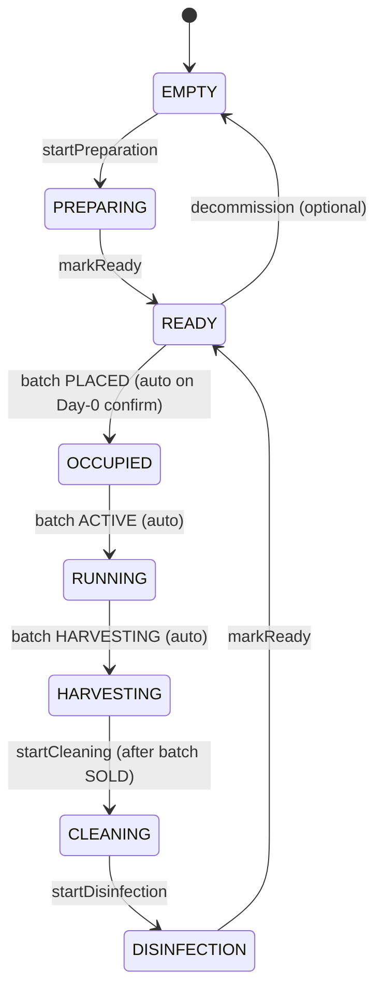
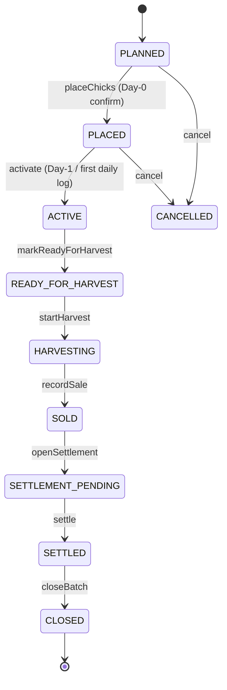
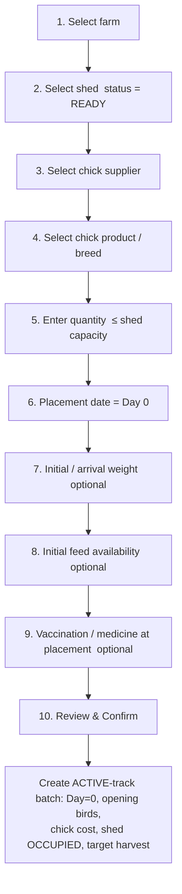
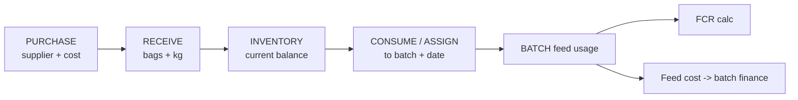
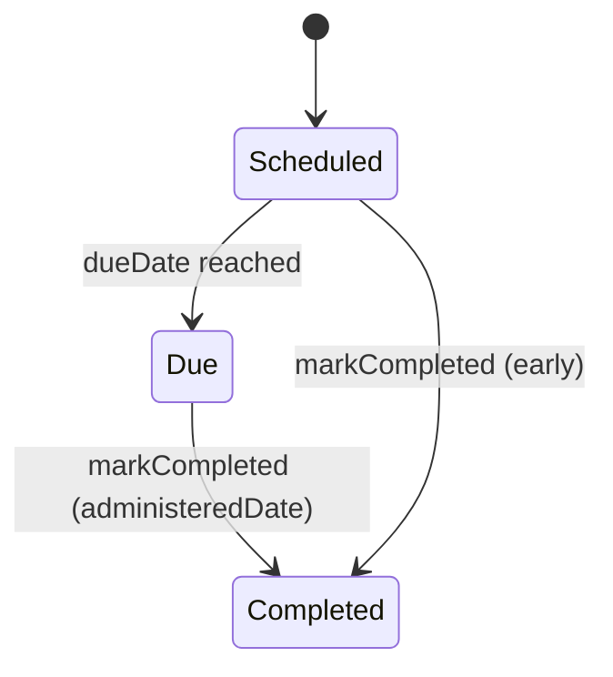

# 07 — Farmer Module Spec

The **Farmer module** is the central production engine of KukkuOne and is **built
first**. It owns the batch — the platform's single source of truth — from chick
placement (Day 0) through daily operations, growth, finance, harvest, settlement,
and shed reset for the next cycle. This document is the build guide for the
domain, its data, its REST surface, its state machines, and where each capability
surfaces in the clients.

**Backend service:** `kukkuone-farmer-api` (NestJS), reached through the API
gateway under the prefix **`/api/farmer/*`**.
**Persistence:** PostgreSQL + Prisma via `@kukkuone/db`; entity schemas are
defined in [06-Data-Model.md](06-Data-Model.md) and **referenced**, never
redefined here.
**Money:** every monetary value is an **integer in minor units** (e.g. paise/cents)
plus an ISO **currency** code — never a float.

Related docs: [Product Overview](01-Product-Overview.md) ·
[System Architecture](02-System-Architecture.md) ·
[Auth & RBAC](05-Auth-And-RBAC.md) · [Data Model](06-Data-Model.md) ·
[Admin Panel Spec](08-Admin-Panel-Spec.md) ·
[Client Apps Spec](09-Client-Apps-Spec.md) ·
[API Conventions](12-API-Conventions.md) ·
[Roadmap & Milestones](13-Roadmap-And-Milestones.md)

---

## 0. Conventions Used in This Document

### 0.1 Roles & Actions

All endpoints are **org-scoped**. Every record is owned by the caller's `orgId`;
the service enforces **fine-grained RBAC** after the gateway's coarse capability
gate (`FARMER`). Farmer roles and the actions they may perform (see
[05-Auth-And-RBAC.md](05-Auth-And-RBAC.md)):

| Role | View | Create | Edit | Approve | Dispatch | Settle | Report |
|------|:----:|:------:|:----:|:-------:|:--------:|:------:|:------:|
| **Owner** | ✅ | ✅ | ✅ | ✅ | ✅ | ✅ | ✅ |
| **Farm Manager** | ✅ | ✅ | ✅ | ✅ | ✅ | ✅ | ✅ |
| **Farm Operator** | ✅ | ✅ | ✅ | ❌ | ❌ | ❌ | ✅ |
| **Accountant** | ✅ | ✅¹ | ✅¹ | ❌ | ❌ | ✅ | ✅ |

¹ Accountant Create/Edit is limited to **finance** records (expenses, revenue) and
settlement. Operators run day-to-day production (logs, feed/medicine consumption)
but cannot Approve, Dispatch, or Settle.

Endpoint tables below list the **minimum** role. Owner implicitly holds every
action and is omitted from per-row lists for brevity; a row listing "Farm Manager"
means Manager and Owner.

### 0.2 Request/Response Envelope

All responses follow the standard envelope from
[12-API-Conventions.md](12-API-Conventions.md):

```jsonc
{ "data": { /* resource */ }, "meta": { "requestId": "…", "ts": "…" } }
// errors:
{ "error": { "code": "BATCH_INVALID_TRANSITION", "message": "…", "details": [] },
  "meta": { "requestId": "…", "ts": "…" } }
```

- List endpoints accept `?page`, `?pageSize`, `?sort`, and resource filters, and
  return `meta.page`, `meta.total`.
- All timestamps are ISO-8601 UTC. All writes stamp `actorUserId`, `orgId`,
  `createdAt/updatedAt`, and emit an **audit** entry (before/after).
- Mutating a state machine uses an explicit **action sub-resource**
  (`POST …/:id/<action>`) rather than a raw `PATCH status`, so guards run
  server-side and transitions are auditable.

### 0.3 Money & Units

| Concept | Representation |
|---------|----------------|
| Money | `{ "amountMinor": 125000, "currency": "INR" }` (integer minor units) |
| Weight | grams (integer) for sample/bird weights; kg (integer grams internally) for feed |
| Feed quantity | tracked in **both** bags (integer) and kg (integer grams) |
| Percentages | computed server-side, returned as decimals rounded to 2 places |

---

## 1. Farm Management

**What it does.** A farmer org may own **multiple farms**. A Farm is the top
container for sheds and batches: profile, geographic location, land/built area,
operational status, and free-form metadata (registration numbers, biosecurity
notes, contact).

**Key data** (see [06-Data-Model.md](06-Data-Model.md) → `Farm`): `id`, `orgId`,
`name`, `code`, `status`, `location { addressLine, city, state, country, pincode,
lat, lng }`, `areaSqM`, `metadata` (JSON), `createdAt`, `updatedAt`,
`archivedAt?`.

**Farm status:** `ACTIVE`, `INACTIVE`, `ARCHIVED`. Archiving is a soft state — a
farm with any non-`CLOSED` batch or `OCCUPIED/RUNNING` shed **cannot** be
archived.

### 1.1 Endpoints

| Method | Path | Purpose | Roles |
|--------|------|---------|-------|
| GET | `/api/farmer/farms` | List farms for the org (filter `status`) | Farm Operator |
| POST | `/api/farmer/farms` | Create a farm | Farm Manager |
| GET | `/api/farmer/farms/:farmId` | Get farm profile + shed/batch counts | Farm Operator |
| PATCH | `/api/farmer/farms/:farmId` | Edit profile/location/area/metadata | Farm Manager |
| POST | `/api/farmer/farms/:farmId/archive` | Archive (guarded) | Owner |
| POST | `/api/farmer/farms/:farmId/activate` | Return to `ACTIVE` | Farm Manager |

### 1.2 Validation

- `name` required, 2–120 chars; `code` unique per org (auto-generated if omitted).
- `location.lat/lng` optional but, if present, both required and in range.
- `areaSqM` ≥ 0. `pincode` validated against country format.
- Archive guard: reject `409 FARM_HAS_ACTIVE_WORK` if any shed ≠ `EMPTY/READY` or
  any batch not in `CLOSED`.

### 1.3 Surfaces

- **Admin** ([08](08-Admin-Panel-Spec.md)): Farms table, create/edit drawer,
  archive action, per-farm drill-down. Platform admins can view across orgs.
- **Web/Mobile** ([09](09-Client-Apps-Spec.md)): Farm switcher in the app header;
  Farm profile screen; "Add farm" flow (Manager+).

---

## 2. Shed Management

**What it does.** A Shed (house) belongs to a Farm and holds **one active batch at
a time**. It tracks capacity, current lifecycle status, current batch link,
equipment/metadata, and its **historical batches**. The shed lifecycle enforces the
biosecurity cycle (harvest → clean → disinfect → ready) between batches.

**Key data** (see [06-Data-Model.md](06-Data-Model.md) → `Shed`): `id`, `orgId`,
`farmId`, `name`, `code`, `capacityBirds`, `status`, `currentBatchId?`,
`equipment` (JSON: feeders, drinkers, brooders, ventilation), `metadata`,
`lastCycle { cleanedAt?, disinfectedAt?, readyAt? }`. Historical batches are
`Batch` rows referencing `shedId` (queryable, not duplicated).

### 2.1 Shed Lifecycle State Machine



**Transition table** — who may trigger and the guard:

| From | To | Trigger | Who | Guard |
|------|----|---------|-----|-------|
| EMPTY | PREPARING | `startPreparation` | Farm Operator | none |
| PREPARING | READY | `markReady` | Farm Operator | prep checklist complete |
| READY | OCCUPIED | *(auto)* Day-0 confirm | system | shed `READY`, capacity ≥ placed qty |
| OCCUPIED | RUNNING | *(auto)* batch → ACTIVE | system | first daily log or Day-1 |
| RUNNING | HARVESTING | *(auto)* batch → HARVESTING | system | batch `READY_FOR_HARVEST` |
| HARVESTING | CLEANING | `startCleaning` | Farm Operator | batch `SOLD` |
| CLEANING | DISINFECTION | `startDisinfection` | Farm Operator | cleaning logged |
| DISINFECTION | READY | `markReady` | Farm Manager | disinfection logged + downtime met |
| READY | EMPTY | `decommission` | Farm Manager | no `currentBatchId` |

> **Coupling rule.** `OCCUPIED/RUNNING/HARVESTING` are **driven by the batch**
> state machine (§3) and are never set directly. `CLEANING → DISINFECTION →
> READY` is driven manually by the operator during **settlement & reset** (§11).

### 2.2 Endpoints

| Method | Path | Purpose | Roles |
|--------|------|---------|-------|
| GET | `/api/farmer/farms/:farmId/sheds` | List sheds (filter `status`) | Farm Operator |
| POST | `/api/farmer/farms/:farmId/sheds` | Create a shed | Farm Manager |
| GET | `/api/farmer/sheds/:shedId` | Shed detail + current batch + equipment | Farm Operator |
| PATCH | `/api/farmer/sheds/:shedId` | Edit capacity/equipment/metadata | Farm Manager |
| GET | `/api/farmer/sheds/:shedId/batches` | Historical batches for this shed | Farm Operator |
| POST | `/api/farmer/sheds/:shedId/prepare` | EMPTY → PREPARING | Farm Operator |
| POST | `/api/farmer/sheds/:shedId/ready` | PREPARING/DISINFECTION → READY | Farm Operator² |
| POST | `/api/farmer/sheds/:shedId/clean` | HARVESTING → CLEANING | Farm Operator |
| POST | `/api/farmer/sheds/:shedId/disinfect` | CLEANING → DISINFECTION | Farm Operator |
| POST | `/api/farmer/sheds/:shedId/decommission` | READY → EMPTY | Farm Manager |

² PREPARING→READY: Operator. DISINFECTION→READY: Farm Manager (downtime sign-off).

### 2.3 Validation

- `capacityBirds` > 0; a Day-0 placement whose `quantity` > `capacityBirds` is
  rejected `422 SHED_CAPACITY_EXCEEDED`.
- Every lifecycle action validates the **current** status against the table;
  illegal transitions return `409 SHED_INVALID_TRANSITION`.
- A shed cannot be edited to a capacity **below** the current batch's opening bird
  count.

### 2.4 Surfaces

- **Admin**: Shed grid per farm with status chips; lifecycle action buttons;
  equipment editor.
- **Web/Mobile**: Shed cards on the Farm screen (status + occupancy + batch age);
  operator lifecycle actions; reset checklist in the mobile field flow.

---

## 3. Batch — The Central Business Object

**What it does.** The Batch is the unit of truth for a production cycle: one flock
placed in one shed, tracked from `PLANNED` to `CLOSED`. Every daily log, feed and
medicine consumption, vaccination, weight sample, expense, revenue, harvest, and
settlement record hangs off a `batchId`.

**Key data** (see [06-Data-Model.md](06-Data-Model.md) → `Batch`):

| Field | Notes |
|-------|-------|
| `id`, `orgId`, `farmId`, `shedId` | ownership + placement |
| `code` | human-readable, unique per org |
| `status` | see state machine below |
| `breed`, `chickSupplierId`, `chickProductId` | source |
| `placementDate` | Day-0 date; `ageDays` is derived = `today − placementDate` |
| `openingBirdCount` | birds placed at Day 0 (immutable after ACTIVE) |
| `currentBirdCount` | derived from latest daily log closing birds |
| `chickCostMinor`, `currency` | opening chick cost |
| `targetHarvestDate`, `targetWeightGrams` | plan/targets |
| `harvestVisibility` | `HIDDEN` \| `NETWORK` (distributor discovery flag, §10) |
| `linkedInputOrderId?` | the supplier order this placement was received from |
| timestamps + audit | standard |

### 3.1 Batch Lifecycle State Machine



### 3.2 Transition Guards

| Transition | Trigger | Who | Guard |
|-----------|---------|-----|-------|
| PLANNED → PLACED | `placeChicks` | Farm Manager | shed `READY`; qty ≤ capacity; supplier+product+date set (§4) |
| PLACED → ACTIVE | `activate` | Farm Operator | first daily log OR `ageDays ≥ 1` |
| ACTIVE → READY_FOR_HARVEST | `markReadyForHarvest` | Farm Manager | near target: `ageDays ≥ minAge` **or** `avgWeight ≥ targetWeight × 0.9` |
| READY_FOR_HARVEST → HARVESTING | `startHarvest` | Farm Manager | at least one distributor purchase/collection opened OR manual harvest flag |
| HARVESTING → SOLD | `recordSale` | Farm Manager | sale/collection recorded; birds dispatched |
| SOLD → SETTLEMENT_PENDING | `openSettlement` | Accountant | finance summary computable |
| SETTLEMENT_PENDING → SETTLED | `settle` | Accountant | settlement outcome recorded, balance reconciled |
| SETTLED → CLOSED | `closeBatch` | Farm Manager | shed reset **started** (CLEANING+) |
| PLANNED/PLACED → CANCELLED | `cancel` | Owner | no daily logs recorded (PLACED); frees shed → READY |

- Any illegal transition → `409 BATCH_INVALID_TRANSITION`.
- `openingBirdCount`, `placementDate`, `chickCost` are **immutable** once the batch
  reaches `ACTIVE` (corrections go through an audited adjustment, not an edit).

### 3.3 Endpoints

| Method | Path | Purpose | Roles |
|--------|------|---------|-------|
| GET | `/api/farmer/batches` | List batches (filter `status`,`farmId`,`shedId`) | Farm Operator |
| GET | `/api/farmer/batches/:batchId` | Batch header + derived counts | Farm Operator |
| POST | `/api/farmer/batches` | Create `PLANNED` batch (optional pre-plan) | Farm Manager |
| PATCH | `/api/farmer/batches/:batchId` | Edit targets/visibility/metadata (pre-ACTIVE fields guarded) | Farm Manager |
| POST | `/api/farmer/batches/:batchId/activate` | PLACED → ACTIVE | Farm Operator |
| POST | `/api/farmer/batches/:batchId/ready-for-harvest` | ACTIVE → READY_FOR_HARVEST | Farm Manager |
| POST | `/api/farmer/batches/:batchId/start-harvest` | READY_FOR_HARVEST → HARVESTING | Farm Manager |
| POST | `/api/farmer/batches/:batchId/record-sale` | HARVESTING → SOLD | Farm Manager |
| POST | `/api/farmer/batches/:batchId/cancel` | → CANCELLED | Owner |

> Placement (`PLANNED/none → PLACED`) has its own workflow endpoint — see §4.
> Settlement/close (`SOLD → … → CLOSED`) — see §11.

### 3.4 Surfaces

- **Admin**: Batch registry across the org with lifecycle filter, per-batch console
  (logs, finance, growth tabs).
- **Web/Mobile**: Batch list (active first), Batch detail with tabs
  (Overview/Daily/Feed/Health/Growth/Finance/Harvest). Mobile is the primary
  data-entry surface.

---

## 4. Day 0 — Chick Placement Workflow

**What it does.** A single guided flow that creates a live batch at Day 0. It is
the transition `PLANNED/none → PLACED` and, on confirm, wires up bird count, chick
cost, shed occupancy, and the target harvest plan. Where the chicks arrived from a
received supplier order, the flow links that order (`linkedInputOrderId`) so the
**order → dispatch → receipt → placement** handoff is traceable end to end.

### 4.1 Ordered Steps



| # | Step | Required | Rule |
|---|------|:---:|------|
| 1 | Select farm | ✅ | must be `ACTIVE`, owned by org |
| 2 | Select shed | ✅ | must be `READY`; sets `shedId` |
| 3 | Chick supplier | ✅ | supplier org / master; may be prefilled from linked order |
| 4 | Chick product / breed | ✅ | sets `breed`, `chickProductId` |
| 5 | Quantity | ✅ | integer > 0, ≤ `shed.capacityBirds` → `openingBirdCount` |
| 6 | Placement date | ✅ | ≤ today, ≥ shed `readyAt`; sets Day 0 |
| 7 | Initial/arrival weight | ⬜ | grams; seeds growth curve if given |
| 8 | Initial feed availability | ⬜ | opening feed on hand (type + bags/kg) → seeds feed inventory (§6) |
| 9 | Vaccination / medicine at placement | ⬜ | Day-0 vaccination or medication events (§7) |
| 10 | Confirm | ✅ | atomic commit |

### 4.2 On Confirm (atomic)

The service performs one transaction:

1. Create Batch: `status = PLACED` (auto-advances to `ACTIVE` on first log/Day-1),
   `placementDate`, `openingBirdCount = quantity`, `currentBirdCount = quantity`.
2. Record **chick cost** (`chickCostMinor`, `currency`) as the opening cost and as
   a `CHICK` expense line (§9).
3. Set shed `status = OCCUPIED`, `currentBatchId = batch.id`.
4. Compute **target harvest**: `targetHarvestDate`, `targetWeightGrams` (from breed
   defaults or input).
5. If provided: seed initial arrival weight sample, initial feed inventory, Day-0
   vaccination/medicine events.
6. If `linkedInputOrderId` present, mark the order line **placed**.
7. Emit audit + `BATCH_PLACED` event.

### 4.3 Endpoint

| Method | Path | Purpose | Roles |
|--------|------|---------|-------|
| POST | `/api/farmer/batches/place` | Day-0 placement (creates PLACED batch atomically) | Farm Manager |

**Request example:**

```jsonc
POST /api/farmer/batches/place
{
  "farmId": "farm_01H…",
  "shedId": "shed_01H…",
  "chickSupplierId": "org_supp_01H…",
  "chickProductId": "prod_cobb500",
  "breed": "Cobb 500",
  "quantity": 5000,
  "placementDate": "2026-08-09",
  "chickCost": { "amountMinor": 17500000, "currency": "INR" },
  "arrivalWeightGrams": 42,
  "initialFeed": { "feedType": "STARTER", "bags": 40, "kg": 2000 },
  "placementVaccinations": [
    { "vaccineId": "vac_ND_B1", "route": "OCULAR", "doses": 5000 }
  ],
  "placementMedicines": [
    { "medicineId": "med_multivit", "qty": 2, "unit": "L", "reason": "Anti-stress" }
  ],
  "targetHarvestDate": "2026-09-20",
  "targetWeightGrams": 2200,
  "harvestVisibility": "HIDDEN",
  "linkedInputOrderId": "sord_01H…"
}
```

**Response example:**

```jsonc
201 Created
{
  "data": {
    "id": "batch_01H…",
    "code": "B-2026-014",
    "status": "PLACED",
    "farmId": "farm_01H…",
    "shedId": "shed_01H…",
    "breed": "Cobb 500",
    "placementDate": "2026-08-09",
    "ageDays": 0,
    "openingBirdCount": 5000,
    "currentBirdCount": 5000,
    "chickCost": { "amountMinor": 17500000, "currency": "INR" },
    "targetHarvestDate": "2026-09-20",
    "targetWeightGrams": 2200,
    "harvestVisibility": "HIDDEN",
    "shed": { "id": "shed_01H…", "status": "OCCUPIED" }
  },
  "meta": { "requestId": "req_…", "ts": "2026-08-09T06:12:04Z" }
}
```

### 4.4 Validation

- Reject `422 SHED_NOT_READY` if shed ≠ `READY`; `422 SHED_CAPACITY_EXCEEDED` if
  `quantity > capacityBirds`.
- `placementDate` not in the future, not before shed `readyAt`.
- `chickCost.amountMinor` ≥ 0; currency required.
- Whole flow is transactional — partial failure rolls back (no orphan
  OCCUPIED shed).

### 4.5 Surfaces

- **Mobile** ([09](09-Client-Apps-Spec.md)): the **primary** placement wizard
  (stepper matching §4.1), including scan/select of a received order.
- **Web**: same wizard for Managers.
- **Admin**: read-only placement record on the batch console.

---

## 5. Daily Farm Operations

**What it does.** The **Daily Farm Log** is the operator's once-per-day record for
a batch. It captures survival, growth sampling, intake, health, and environment,
and drives every derived metric (current birds, mortality %, FCR).

**Key data** (see [06-Data-Model.md](06-Data-Model.md) → `DailyLog`):

| Group | Fields |
|-------|--------|
| Population | `openingBirds` (prefilled = prior closing), `mortality`, `culls`, `closingBirds` (auto) |
| Weight sample | `weightSampleQty`, `avgWeightGrams`, optional `minWeightGrams`, `maxWeightGrams`, `uniformityPct` |
| Feed | `feedType` (`STARTER`/`GROWER`/`FINISHER`), `feedConsumedKg` |
| Water | `waterLiters` |
| Health | `medicineTreatment` (refs §7), `healthNotes` |
| Environment | `tempC`, `humidityPct` |
| Meta | `notes`, `attachments[]`, `logDate`, `actorUserId` |

### 5.1 Auto-Calculations

| Metric | Formula |
|--------|---------|
| **Closing birds** | `closingBirds = openingBirds − mortality − culls` |
| **Daily mortality %** | `dailyMortality / openingBirds × 100` |
| **Cumulative mortality %** | `Σ(mortality + culls) / openingBirdCount × 100` |
| **Livability %** | `100 − cumulativeMortality%` |
| **Uniformity %** (if min/max absent) | optional server estimate from sample spread, **labeled estimate** |

`currentBirdCount` on the batch is updated to the latest log's `closingBirds`.

### 5.2 One-Log-Per-Day + Edit/Lock Policy

- **Unique constraint:** one log per `(batchId, logDate)`. A second create for the
  same day returns `409 DAILY_LOG_EXISTS` — the client must edit instead.
- **Edit window:** a log is **editable by Operator/Manager for the current day and
  the immediately prior day** (`logDate ≥ today − 1`).
- **Lock:** older logs are **locked**; only a Farm Manager may edit within a
  configurable grace window (default 3 days) via an audited correction. After that,
  or once the batch is `SOLD+`, logs are **read-only** (`423 DAILY_LOG_LOCKED`).
- **Sequencing:** `openingBirds` must equal the previous day's `closingBirds`;
  mismatch → `422 DAILY_LOG_CONTINUITY`.

### 5.3 Endpoints

| Method | Path | Purpose | Roles |
|--------|------|---------|-------|
| GET | `/api/farmer/batches/:batchId/daily-logs` | List logs (filter date range) | Farm Operator |
| POST | `/api/farmer/batches/:batchId/daily-logs` | Create today's log (one/day) | Farm Operator |
| GET | `/api/farmer/batches/:batchId/daily-logs/:date` | Get log for a date | Farm Operator |
| PATCH | `/api/farmer/batches/:batchId/daily-logs/:date` | Edit within window | Farm Operator |
| POST | `/api/farmer/daily-logs/:logId/lock` | Manager force-lock a log | Farm Manager |

### 5.4 Validation

- `mortality, culls ≥ 0`; `mortality + culls ≤ openingBirds`.
- `avgWeightGrams > 0` when `weightSampleQty > 0`; `minWeight ≤ avgWeight ≤ maxWeight`.
- `feedConsumedKg ≥ 0`; `feedType` required when `feedConsumedKg > 0` and must
  have inventory balance (§6) or a warning flag is returned.
- First log on a `PLACED` batch auto-advances it to `ACTIVE`.

### 5.5 Surfaces

- **Mobile**: the daily-entry hub — prefilled opening birds, sample calculator,
  offline-capable, attachment capture. Primary surface.
- **Web**: table + form for Managers; bulk review.
- **Admin**: per-batch daily-log timeline (read-only) with lock indicators.

---

## 6. Feed Management

**What it does.** Tracks feed from purchase to per-batch consumption and cost,
across the three phases (**Starter / Grower / Finisher**), and feeds the FCR
metric. Quantities are carried in **both bags and kg**.

**Flow:**



**Key data** (see [06-Data-Model.md](06-Data-Model.md)):
`FeedPurchase` (supplier, feedType, bags, kg, `unitCostMinor`, `totalCostMinor`,
currency, purchaseDate), `FeedReceipt` (purchase ref, received bags/kg, date),
`FeedInventory` (per org/farm/feedType balance in bags + kg), `FeedConsumption`
(`batchId`, `logDate`, feedType, kg, derived cost).

### 6.1 FCR Calculation

```
FCR = totalFeedConsumedKg (batch) / totalLiveWeightGainKg (batch)

totalLiveWeightGainKg = (currentBirdCount × avgWeightGrams
                         − openingBirdCount × arrivalWeightGrams) / 1000
```

When arrival weight is unknown, gain is computed from `avgWeightGrams × currentBirdCount`
and the value is **labeled an estimate**. Feed cost per batch is the sum of
consumption × the feed's effective unit cost (weighted by receipt cost).

### 6.2 Endpoints

| Method | Path | Purpose | Roles |
|--------|------|---------|-------|
| GET | `/api/farmer/feed/purchases` | List feed purchases | Farm Operator |
| POST | `/api/farmer/feed/purchases` | Record a purchase (supplier, cost) | Farm Manager |
| POST | `/api/farmer/feed/purchases/:id/receive` | Receive stock → inventory | Farm Operator |
| GET | `/api/farmer/feed/inventory` | Current balances (filter farm/feedType) | Farm Operator |
| POST | `/api/farmer/feed/consumption` | Assign consumption to batch+date | Farm Operator |
| GET | `/api/farmer/batches/:batchId/feed` | Batch feed usage + cost + FCR | Farm Operator |

### 6.3 Validation

- `bags ≥ 0`, `kg ≥ 0`, at least one > 0; consumption cannot drive inventory
  below zero → `422 FEED_INSUFFICIENT_BALANCE` (or a soft warning if negative
  stock is allowed by org config).
- Consumption `logDate` must fall within the batch's active window.
- A `FeedConsumption` row is idempotent per `(batchId, logDate, feedType)` and
  reconciles with the daily log's `feedConsumedKg`.

### 6.4 Surfaces

- **Mobile**: quick "assign feed to batch" + low-feed alert; receive stock.
- **Web**: feed purchases/inventory management for Managers.
- **Admin**: feed ledger and per-org balances.

---

## 7. Medicine & Health

**What it does.** Manages medicine inventory and usage, the vaccination schedule,
and disease/health events with treatments — all attached to a batch.

**Key data** (see [06-Data-Model.md](06-Data-Model.md)):
`MedicineInventory` (item, unit, balance, `unitCostMinor`),
`MedicineUsage` (`batchId`, `date`, `qty`, `reason`, derived `costMinor`),
`Vaccination` (`batchId`, vaccine, `scheduledDate`, `dueDate`, `status`, `route`,
`doses`, `administeredDate?`), `HealthEvent` (`batchId`, `date`, `type`, `severity`,
`affectedCount`, `treatment`, `outcome`).

### 7.1 Vaccination Status Machine



- `Scheduled` → `Due` is **time-driven** (a daily job flips schedules whose
  `dueDate ≤ today`, feeding the "vaccination due" alert, §12).
- `Completed` requires `administeredDate` and `doses`; records an optional
  `MedicineUsage`/cost line.

### 7.2 Endpoints

| Method | Path | Purpose | Roles |
|--------|------|---------|-------|
| GET | `/api/farmer/medicine/inventory` | Medicine balances | Farm Operator |
| POST | `/api/farmer/medicine/inventory` | Add/adjust stock (purchase/receipt) | Farm Manager |
| POST | `/api/farmer/medicine/usage` | Record usage (date/batch/qty/reason/cost) | Farm Operator |
| GET | `/api/farmer/batches/:batchId/vaccinations` | Vaccination schedule for batch | Farm Operator |
| POST | `/api/farmer/batches/:batchId/vaccinations` | Schedule a vaccination | Farm Manager |
| POST | `/api/farmer/vaccinations/:id/complete` | Mark completed (administered) | Farm Operator |
| GET | `/api/farmer/batches/:batchId/health-events` | List health events | Farm Operator |
| POST | `/api/farmer/batches/:batchId/health-events` | Record disease/health event + treatment | Farm Operator |

### 7.3 Validation

- Usage `qty > 0` and ≤ inventory balance → else `422 MEDICINE_INSUFFICIENT_BALANCE`.
- Vaccination `dueDate ≥ scheduledDate`; cannot complete a vaccination for a
  `CLOSED` batch.
- `HealthEvent.affectedCount ≤ currentBirdCount`.

### 7.4 Surfaces

- **Mobile**: vaccination checklist with due badges, one-tap complete; medicine
  usage entry; report a health event.
- **Web/Admin**: schedule builder (auto-generate program by breed/age), medicine
  ledger, disease log.

---

## 8. Growth & Performance

**What it does.** Turns daily logs into growth curves and per-batch performance
summaries. **Actual recorded values are the source of truth; any projected value
is explicitly labeled an estimate.**

**Key derived metrics** (computed, not stored raw):

| Metric | Source |
|--------|--------|
| Weight vs age curve | daily weight samples over `ageDays` |
| Current bird count | latest daily log `closingBirds` |
| Average weight | latest sample `avgWeightGrams` |
| Total live weight | `currentBirdCount × avgWeightGrams` |
| Cumulative mortality % / livability % | §5.1 |
| Feed consumed + FCR | §6.1 |
| ADG (avg daily gain) | `(avgWeight − arrivalWeight) / ageDays` |

### 8.1 Endpoints

| Method | Path | Purpose | Roles |
|--------|------|---------|-------|
| GET | `/api/farmer/batches/:batchId/performance` | Performance summary (all metrics, actual vs estimate flags) | Farm Operator |
| GET | `/api/farmer/batches/:batchId/growth-trend` | Time series (weight/mortality/feed/FCR by day) | Farm Operator |
| GET | `/api/farmer/farms/:farmId/performance` | Cross-batch farm rollup | Farm Manager |

**Performance summary example:**

```jsonc
GET /api/farmer/batches/batch_01H…/performance
{
  "data": {
    "batchId": "batch_01H…",
    "ageDays": 31,
    "openingBirdCount": 5000,
    "currentBirdCount": 4830,
    "avgWeightGrams": { "value": 1850, "source": "actual" },
    "totalLiveWeightKg": { "value": 8935, "source": "actual" },
    "cumulativeMortalityPct": 3.40,
    "livabilityPct": 96.60,
    "feedConsumedKg": 15200,
    "fcr": { "value": 1.70, "source": "actual" },
    "adgGrams": { "value": 58.3, "source": "actual" },
    "projectedHarvestWeightGrams": { "value": 2210, "source": "estimate" }
  },
  "meta": { "requestId": "req_…", "ts": "2026-09-09T04:00:00Z" }
}
```

### 8.2 Surfaces

- **Mobile/Web**: Growth tab — weight/FCR/mortality charts (see
  [dataviz conventions in 09](09-Client-Apps-Spec.md)); estimate badges.
- **Admin**: benchmark batches across farms; flag underperformers.

---

## 9. Batch Finance

**What it does.** Aggregates all **costs** and **revenue** for a batch and computes
final unit economics. All money is integer minor units + currency.

**Cost categories:** `CHICK`, `FEED`, `MEDICINE`, `VACCINATION`, `LABOUR`,
`ELECTRICITY`, `WATER`, `TRANSPORT`, `OTHER`.
**Revenue categories:** `BIRD_SALE`, `MANURE`, `OTHER`.

Chick/feed/medicine/vaccination costs flow **automatically** from §4/§6/§7;
labour/electricity/water/transport/other are entered as expense lines.

**Key data** (see [06-Data-Model.md](06-Data-Model.md)): `BatchExpense`
(`batchId`, `category`, `amountMinor`, `currency`, `date`, `note`, `sourceRef?`),
`BatchRevenue` (`batchId`, `category`, `amountMinor`, `currency`, `date`,
`qty?`, `weightKg?`, `note`).

### 9.1 Final Metrics & Formulas

| Metric | Formula |
|--------|---------|
| Total revenue | `Σ BatchRevenue.amountMinor` |
| Total cost | `Σ BatchExpense.amountMinor` |
| Batch profit | `totalRevenue − totalCost` |
| Cost / bird | `totalCost / openingBirdCount` |
| Cost / kg | `totalCost / totalLiveWeightKg` (or sold weight at close) |
| Revenue / bird | `totalRevenue / soldBirdCount` |
| Revenue / kg | `totalRevenue / soldWeightKg` |
| Profit / bird | `batchProfit / soldBirdCount` |
| Profit / kg | `batchProfit / soldWeightKg` |

> `/kg` metrics use **sold weight** once the batch is `SOLD`; before that they use
> current total live weight and are labeled estimates (§8).

### 9.2 Endpoints

| Method | Path | Purpose | Roles |
|--------|------|---------|-------|
| GET | `/api/farmer/batches/:batchId/expenses` | List expenses | Accountant |
| POST | `/api/farmer/batches/:batchId/expenses` | Add expense line | Accountant |
| PATCH | `/api/farmer/expenses/:id` | Edit an expense (pre-SETTLED) | Accountant |
| DELETE | `/api/farmer/expenses/:id` | Remove a manual expense (pre-SETTLED) | Accountant |
| GET | `/api/farmer/batches/:batchId/revenue` | List revenue | Accountant |
| POST | `/api/farmer/batches/:batchId/revenue` | Add revenue line | Accountant |
| PATCH | `/api/farmer/revenue/:id` | Edit a revenue line (pre-SETTLED) | Accountant |
| DELETE | `/api/farmer/revenue/:id` | Remove a revenue line (pre-SETTLED) | Accountant |
| GET | `/api/farmer/batches/:batchId/finance-summary` | Full P&L + unit economics | Accountant |

### 9.3 Validation

- `amountMinor ≥ 0`, currency required and consistent with the batch currency.
- Auto-generated cost lines (`CHICK`, `FEED`, `MEDICINE`, `VACCINATION` with a
  `sourceRef`) are **read-only** — edit the source record instead.
- Finance records are **frozen** once the batch is `SETTLED`
  (`423 BATCH_FINANCE_LOCKED`).

### 9.4 Surfaces

- **Web/Admin**: Accountant's Finance tab — expense/revenue tables, live P&L,
  unit-economics tiles.
- **Mobile**: read-only finance summary; quick manual expense entry.

---

## 10. Harvest Management

**What it does.** Surfaces batches approaching their harvest window, lets a Manager
mark `READY_FOR_HARVEST`, and — subject to a **per-farmer visibility flag** —
exposes eligible-batch info to the distributor network for discovery (handoff into
the distributor loop, [01](01-Product-Overview.md) §4).

**Eligibility signal** (per batch): `ageDays`, `currentBirdCount`, `avgWeightGrams`,
`estimatedLiveWeightKg`, `harvestWindow { earliest, latest }`, `targetWeightGrams`.

**Visibility flag** (`Batch.harvestVisibility`):

| Value | Meaning |
|-------|---------|
| `HIDDEN` | not discoverable by distributors (default) |
| `NETWORK` | eligible batch info exposed to the distributor discovery feed |

Only batches in `READY_FOR_HARVEST` **and** `harvestVisibility = NETWORK` appear in
distributor discovery. The farmer controls exposure; no PII beyond farm
locality/necessary logistics is shared (see [05](05-Auth-And-RBAC.md) privacy
rules).

### 10.1 Endpoints

| Method | Path | Purpose | Roles |
|--------|------|---------|-------|
| GET | `/api/farmer/harvest/eligible` | Batches near target harvest (window, weight, birds) | Farm Manager |
| POST | `/api/farmer/batches/:batchId/ready-for-harvest` | ACTIVE → READY_FOR_HARVEST | Farm Manager |
| PATCH | `/api/farmer/batches/:batchId/visibility` | Set `HIDDEN`/`NETWORK` | Farm Manager |
| GET | `/api/farmer/batches/:batchId/harvest-info` | Harvest snapshot (age/birds/avg weight/est live weight/window) | Farm Operator |

> The distributor service reads exposed batches through the gateway; farmer-api is
> the **owner** of the visibility flag and eligibility data. It never calls the
> distributor service directly (see [02](02-System-Architecture.md) §3.1).

### 10.2 Validation

- `ready-for-harvest` guard = §3.2 (`ageDays ≥ minAge` or `avgWeight ≥ target × 0.9`).
- `visibility = NETWORK` allowed only for `ACTIVE`/`READY_FOR_HARVEST` batches.
- Reverting to `HIDDEN` withdraws the batch from discovery immediately.

### 10.3 Surfaces

- **Mobile/Web**: Harvest tab — "near harvest" list, mark-ready action, a
  visibility toggle with a confirmation of what distributors will see.
- **Admin**: harvest pipeline across the org.
- **Distributor** ([09](09-Client-Apps-Spec.md)): discovery feed consumes
  `NETWORK` batches.

---

## 11. Settlement, Closure & Shed Reset

**What it does.** Records the sale/settlement outcome, advances the batch
`SOLD → SETTLEMENT_PENDING → SETTLED → CLOSED`, then drives the shed through
`CLEANING → DISINFECTION → READY` so the next batch can be placed. This closes the
production loop.

```mermaid
sequenceDiagram
  participant M as Farm Manager / Accountant
  participant FA as farmer-api
  participant DB as Postgres
  M->>FA: POST /batches/:id/record-sale (sold qty + weight + rate)
  FA->>DB: batch HARVESTING → SOLD; write BIRD_SALE revenue
  M->>FA: POST /batches/:id/settlement/open
  FA->>DB: batch SOLD → SETTLEMENT_PENDING; snapshot finance
  M->>FA: POST /batches/:id/settlement (outcome, amount, ref)
  FA->>DB: batch → SETTLED; freeze finance
  M->>FA: POST /sheds/:id/clean  (then /disinfect, then /ready)
  FA->>DB: shed HARVESTING → CLEANING → DISINFECTION → READY
  M->>FA: POST /batches/:id/close
  FA->>DB: batch SETTLED → CLOSED; shed free for next placement
```

### 11.1 Endpoints

| Method | Path | Purpose | Roles |
|--------|------|---------|-------|
| POST | `/api/farmer/batches/:batchId/settlement/open` | SOLD → SETTLEMENT_PENDING | Accountant |
| GET | `/api/farmer/batches/:batchId/settlement` | Settlement record + snapshot | Accountant |
| POST | `/api/farmer/batches/:batchId/settlement` | Record outcome → SETTLED | Accountant |
| POST | `/api/farmer/batches/:batchId/close` | SETTLED → CLOSED | Farm Manager |
| POST | `/api/farmer/sheds/:shedId/clean` | HARVESTING → CLEANING | Farm Operator |
| POST | `/api/farmer/sheds/:shedId/disinfect` | CLEANING → DISINFECTION | Farm Operator |
| POST | `/api/farmer/sheds/:shedId/ready` | DISINFECTION → READY | Farm Manager |

### 11.2 Guard Rules

| Action | Guard |
|--------|-------|
| `settlement/open` | batch must be `SOLD`; finance summary computable |
| `settlement` (settle) | outcome amount + reference present; balance reconciled; sets `SETTLED`, **freezes finance** (§9.3) |
| `close` | batch `SETTLED` **and** shed reset started (`shed.status ∈ {CLEANING, DISINFECTION, READY}`) → else `409 SHED_RESET_REQUIRED` |
| shed `ready` | disinfection logged + configured downtime elapsed → else `422 SHED_DOWNTIME_NOT_MET` |
| After `close` + shed `READY` | shed available for the next Day-0 placement (§4) |

> **Loop invariant.** A batch **cannot** reach `CLOSED` unless its shed has entered
> the cleaning/disinfection reset, guaranteeing biosecurity between flocks. This
> encodes acceptance criterion #8 ([01](01-Product-Overview.md) §6).

### 11.3 Surfaces

- **Web/Admin**: settlement recording (Accountant), close action, reset checklist.
- **Mobile**: operator reset flow (clean → disinfect → ready) with photo evidence.

---

## 12. Farmer Dashboard & Alerts

**What it does.** Answers the three guiding questions
([01](01-Product-Overview.md) §5) for the farmer: **what happened**, **what needs
attention today**, **what next** — as one aggregate payload. The gateway may merge
supplier/distributor slices for the loop view (see [02](02-System-Architecture.md)
§3.1); farmer-api owns the farmer slice.

### 12.1 Alerts

| Alert | Trigger condition |
|-------|-------------------|
| **Mortality increase** | daily mortality % > rolling baseline × threshold (org-config) |
| **Low feed** | inventory balance for a feedType < N days of projected consumption |
| **Low medicine stock** | medicine balance below reorder level |
| **Vaccination due** | any vaccination flips to `Due` (§7.1) |
| **Harvest approaching** | batch within `harvestWindow` or `avgWeight ≥ target × 0.9` |
| **Settlement pending** | batch `SETTLEMENT_PENDING` beyond configured SLA |

Alerts are emitted by the relevant sub-domain and surfaced on the dashboard feed
and (optionally) push (see [09](09-Client-Apps-Spec.md)).

### 12.2 Endpoints

| Method | Path | Purpose | Roles |
|--------|------|---------|-------|
| GET | `/api/farmer/dashboard` | Aggregate: today's activity, attention items, next actions, KPIs | Farm Operator |
| GET | `/api/farmer/alerts` | Alert feed (filter type/severity/status) | Farm Operator |
| POST | `/api/farmer/alerts/:id/ack` | Acknowledge/dismiss an alert | Farm Operator |

**Dashboard aggregate example:**

```jsonc
GET /api/farmer/dashboard?farmId=farm_01H…
{
  "data": {
    "whatHappened": {
      "logsRecordedToday": 3, "totalActiveBatches": 5,
      "mortalityTodayPct": 0.18, "feedConsumedTodayKg": 1240
    },
    "attentionToday": [
      { "type": "VACCINATION_DUE", "batchId": "batch_01H…", "severity": "HIGH" },
      { "type": "LOW_FEED", "feedType": "FINISHER", "severity": "MEDIUM" }
    ],
    "whatNext": [
      { "action": "MARK_READY_FOR_HARVEST", "batchId": "batch_02H…", "ageDays": 38 },
      { "action": "OPEN_SETTLEMENT", "batchId": "batch_03H…" }
    ],
    "kpis": { "activeBatches": 5, "birdsOnFarm": 23800, "avgFcr": 1.66 }
  },
  "meta": { "requestId": "req_…", "ts": "2026-08-09T05:00:00Z" }
}
```

### 12.3 Surfaces

- **Mobile/Web**: home dashboard — three panels + alert feed + KPI tiles.
- **Admin**: org-wide farmer operations overview.

---

## 13. Acceptance-Criteria Mapping

Maps the farmer-related MVP acceptance criteria
([01-Product-Overview.md](01-Product-Overview.md) §6) to the sections that
implement them.

| # | MVP Acceptance Criterion (farmer-related) | Implemented by |
|---|-------------------------------------------|----------------|
| AC-1 | Order chicks/feed → follow through **dispatch and receipt** handoff | §4 (placement links `linkedInputOrderId`; supplier order/dispatch in supplier-api, receipt handoff consumed at Day-0) |
| AC-2 | Create a **Day-0 batch** and run **daily logs through to harvest** | §4 (placement) · §5 (daily logs) · §3 (lifecycle to HARVESTING) |
| AC-3 | Keep **bird count, feed, health, growth, and cost per batch** | §5 (birds) · §6 (feed/FCR) · §7 (health/medicine/vaccination) · §8 (growth) · §9 (cost) |
| AC-4 | Mark a batch **READY_FOR_HARVEST** | §10 (harvest) · §3.2 (guard) |
| AC-6 | Sale records **actual quantity, weight, rate, adjustments, final amount** | §11 (`record-sale` + settlement) · §9 (finance) |
| AC-7 | Track **settlement status and history** | §11 (settlement endpoints + state) |
| AC-8 | Batch **closes after sale/settlement**; shed → **cleaning → disinfection → ready** | §11 (closure + shed reset) · §2.1 (shed machine) |
| AC-3/10 | All records carry **status, timestamps, org-ownership, audit** | §0.2 (envelope/audit) applied across all sections |
| — | Same org can be both **chick supplier and feed supplier** | Capability model ([01](01-Product-Overview.md) §2); farmer module references supplier orgs by capability, not fixed type |

> AC-5 (distributor discovery) and the distributor side of AC-6/AC-7 are owned by
> distributor-api; the farmer module's contribution is the **harvest-visibility
> handoff** in §10 and the **sale/settlement/close** transitions in §11.

---

*End of 07 — Farmer Module Spec. Cross-references:
[01](01-Product-Overview.md) ·
[02](02-System-Architecture.md) ·
[05](05-Auth-And-RBAC.md) ·
[06](06-Data-Model.md) ·
[08](08-Admin-Panel-Spec.md) ·
[09](09-Client-Apps-Spec.md) ·
[12](12-API-Conventions.md) ·
[13](13-Roadmap-And-Milestones.md).*
