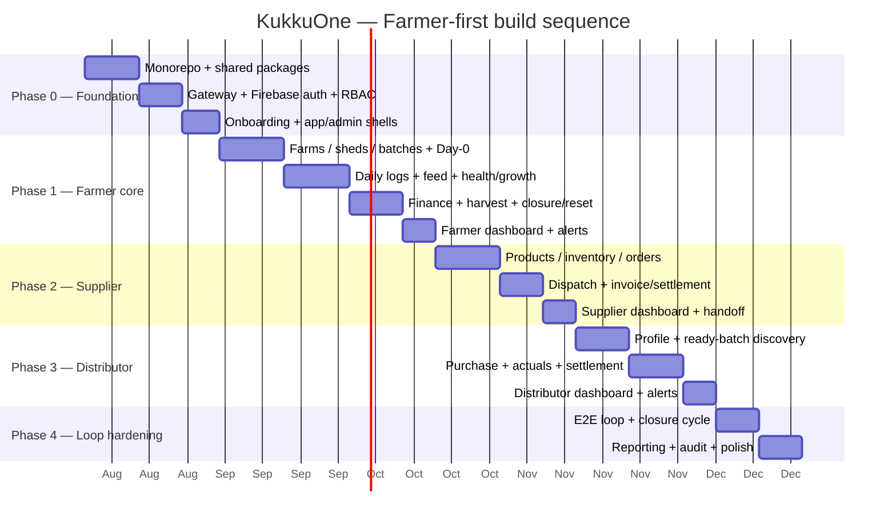

# 13 — Roadmap & Milestones

This is the **phased build order** for KukkuOne. It is deliberately
**farmer-first**: the Farmer ERP is the production engine every other actor
plugs into, and the fastest path to a demonstrable product is a farmer running a
batch end-to-end. Supplier and Distributor modules are then layered on the same
architecture without reshaping it.

Each phase maps explicitly to the **MVP acceptance criteria (1–10)** from the PRD
(restated in [Product Overview](01-Product-Overview.md)) so "done" is never
subjective.

Related docs: [Decision Record](00-Decision-Record.md) ·
[Product Overview](01-Product-Overview.md) ·
[Farmer Module Spec](07-Farmer-Module-Spec.md) ·
[Local Setup & Deploy](11-Local-Setup-And-Deploy.md)

---

## 1. Guiding sequence — and why farmer first

The business loop is **Supplier → Farmer → Distributor → Settlement → Next
batch**. We do **not** build it in that commercial order; we build it in
**value-delivery order**:

1. **Foundation first** — the monorepo, shared packages, auth, and app shells
   must exist before any feature, because every feature depends on them.
2. **Farmer core next** — the farmer is where value is produced and measured
   (birds, feed, health, growth, cost per batch). It stands alone: a farmer can
   place a batch and run it to harvest without any supplier or distributor
   existing yet (Day-0 accepts a manual placement; the supplier link is
   optional). This makes the largest, riskiest module demonstrable earliest.
3. **Supplier then Distributor** — these attach to the two open ends of the
   farmer's batch: the supplier feeds **Day-0** (chicks/feed inbound), the
   distributor consumes **harvest** (purchase + settlement outbound).
4. **Loop hardening last** — once all three actors exist, close and polish the
   full settlement → closure → cleaning → next-batch cycle.

Why not supplier-first (commercial order)? Because a supplier with no farmer to
serve produces nothing to test, and the farmer module is both the biggest schema
and the acceptance-criteria centre of gravity (criteria 2, 3, 4, 8, 10). Build
the engine, then the intake and the outlet.

---

## 2. Phase plan

> Legend — **AC#** refers to MVP acceptance criteria 1–10.

| Phase | Goal | Repos / apps touched | Exit criteria | AC# |
|-------|------|----------------------|---------------|-----|
| **0 — Foundation** | Everything needed to log in, pick a capability, and land in the right shell | monorepo root, `@kukkuone/*` packages, `kukkuone-api-gateway`, `kukkuone-admin-web`, `kukkuone-web`, `kukkuone-mobile`, Docker Compose | See §2.1 exit | 10 (partial) |
| **1 — Farmer core** | A farmer runs a batch Day-0 → harvest → settlement → shed reset with full per-batch records | `kukkuone-farmer-api`, `kukkuone-web`, `kukkuone-mobile`, `kukkuone-admin-web` | See §2.2 exit | 2, 3, 4, 8, 10 |
| **2 — Supplier** | Supplier fulfils farmer orders for chicks/feed through dispatch → receipt, feeding Day-0 | `kukkuone-supplier-api`, `kukkuone-web`, `kukkuone-mobile`, `kukkuone-admin-web` | See §2.3 exit | 1, 9 |
| **3 — Distributor** | Distributor discovers ready batches, records a purchase + actuals, and tracks settlement | `kukkuone-distributor-api`, `kukkuone-web`, `kukkuone-mobile`, `kukkuone-admin-web` | See §2.4 exit | 5, 6, 7 |
| **4 — Loop hardening** | The reliable end-to-end loop, cross-actor dashboards, reporting, audit completeness, polish | all services + all apps | See §2.5 exit | 10 (full) |

### 2.1 Phase 0 — Foundation

**Goal.** Stand up the skeleton so a real user can authenticate, create an org,
select a capability, and be routed to the correct experience — with admin able to
see orgs. No domain features yet.

**Deliverables**

- **Monorepo**: pnpm workspaces + Turborepo pipeline (`build`/`lint`/`test`/`dev`),
  see [Repository Structure](04-Repository-Structure.md).
- **Shared packages**: `@kukkuone/types` (Zod), `@kukkuone/db` (Prisma client +
  schema for **core + farmer**), `@kukkuone/auth` (client/server contracts +
  Firebase adapter), `@kukkuone/config` (env loading), `@kukkuone/api-client`.
- **Postgres + Prisma**: one `DATABASE_URL`; migrations for **core** (users, orgs,
  memberships, capabilities, roles, permissions, external identities, audit log)
  and the **farmer** schema scaffolding.
- **Gateway skeleton**: routing table (§[12](12-API-Conventions.md)), Firebase
  token verification, `Principal` resolution, principal-header injection, coarse
  RBAC guard.
- **Firebase project**: Google sign-in enabled; client SDK wired into web + mobile.
- **Onboarding + capability selection**: signup flow where the user creates an org
  and selects capabilities (Farmer / Distributor / Supplier — any or all).
- **Admin-web shell**: sidebar + header layout, login, org list view
  ([Admin Panel Spec](08-Admin-Panel-Spec.md)).
- **Web + mobile app shells**: role-aware navigation driven by capabilities +
  roles ([Client Apps Spec](09-Client-Apps-Spec.md)).
- **Docker Compose**: Postgres + all services up locally with one command
  ([Local Setup & Deploy](11-Local-Setup-And-Deploy.md)).
- **Seed**: super-admin `naptrixlabs@gmail.com`.

**Exit criteria.** A user can Google-login, create an org, pick the **Farmer**
capability, and land in the farmer experience; the admin can log in and see the
list of orgs. (Establishes AC 10's audit/ownership scaffolding.)

### 2.2 Phase 1 — Farmer core

**Goal.** The full farmer production lifecycle, standalone.

**Deliverables** (all across `kukkuone-farmer-api` + `kukkuone-web` +
`kukkuone-mobile` + admin-web read views — see
[Farmer Module Spec](07-Farmer-Module-Spec.md)):

- **Farms** CRUD; **Sheds** with lifecycle `EMPTY→PREPARING→READY→RUNNING→
  HARVESTING→CLEANING→DISINFECTION→READY`.
- **Batches** with lifecycle `PLANNED→PLACED→ACTIVE→READY_FOR_HARVEST→HARVESTING→
  SOLD→SETTLEMENT_PENDING→SETTLED→CLOSED`.
- **Day-0 placement** (`POST /farmer/batches/place`, optional supplier link).
- **Daily logs** with auto-calcs (mortality, current qty, FCR, ADG, cumulative
  feed/cost).
- **Feed** tracking; **medicine / health / vaccination** records.
- **Growth / performance** metrics per batch.
- **Batch finance** (money as integer minor units + currency).
- **Harvest**: mark `READY_FOR_HARVEST` and expose batch for distributor
  discovery (visibility flag prepared, consumed in Phase 3).
- **Settlement / closure / shed reset**: batch → `SETTLED`/`CLOSED`, shed →
  `CLEANING`→`DISINFECTION`→`READY`.
- **Farmer dashboard + alerts**.

**Exit criteria.** Satisfies **AC 2** (create Day-0 batch + daily logs to
harvest), **AC 3** (bird/feed/health/growth/cost per batch), **AC 4** (mark
`READY_FOR_HARVEST`), **AC 8** (batch closes; shed cleaning→disinfection→ready),
**AC 10** (status/timestamps/org-ownership/audit on all records).

### 2.3 Phase 2 — Supplier

**Goal.** Supplier fulfils the inbound side of Day-0.

**Deliverables** (`kukkuone-supplier-api` + web + mobile + admin-web views):

- **Products** (chick + feed) and **inventory**.
- **Farmer order lifecycle**: `DRAFT→SUBMITTED→RECEIVED→ACCEPTED→PROCESSING→
  READY_FOR_DISPATCH→DISPATCHED→DELIVERED→INVOICED→SETTLED`.
- **Dispatch**, **invoice / settlement**.
- **Supplier dashboard + alerts**.
- **Supplier ↔ farmer handoff**: the order → dispatch → receipt flow whose
  delivered chicks/feed feed the farmer's **Day-0** (closes the optional link left
  open in Phase 1).

**Exit criteria.** Satisfies **AC 1** (farmer orders chicks/feed and follows
through dispatch/receipt) and **AC 9** (the same org can be both chick supplier
and feed supplier).

### 2.4 Phase 3 — Distributor

**Goal.** Distributor consumes the outbound harvest side.

**Deliverables** (`kukkuone-distributor-api` + web + mobile + admin-web views):

- **Distributor profile / operating area**.
- **Ready-to-harvest discovery**: find nearby eligible batches (consumes the
  visibility flag from Phase 1).
- **Purchase record + actual collection**: actual qty / weight / rate /
  adjustments / final amount.
- **Farmer settlement + relationship records**; **settlement status / history**.
- **Distributor dashboard + alerts**.

**Exit criteria.** Satisfies **AC 5** (discover nearby eligible batches + create
purchase), **AC 6** (purchase records actuals/adjustments/final), **AC 7**
(distributor tracks settlement status/history).

### 2.5 Phase 4 — Loop hardening

**Goal.** Make the whole loop reliable and complete, not just individually
functional.

**Deliverables**

- **End-to-end settlement loop**: supplier→farmer→distributor→settlement→next
  batch verified as one continuous flow.
- **Closure → cleaning → disinfection → ready → next batch** proven across
  consecutive batches in the same shed.
- **Cross-actor dashboards / alerts** and **reporting**.
- **Audit completeness** review across every business record and privileged
  action.
- **Polish**: error states, empty states, performance, accessibility.

**Exit criteria.** The full loop runs reliably and **AC 10** holds across every
module (status, timestamps, org-ownership, and audit on all records, everywhere).

---

## 3. Milestone / sequencing view

**Ordered dependency list** (if the gantt is not rendered):

1. Phase 0 → gates everything (no feature ships without shells + auth + schema).
2. Phase 1 → depends on 0; standalone (Day-0 supplier link optional).
3. Phase 2 → depends on 1; closes the Day-0 inbound link.
4. Phase 3 → depends on 1; consumes the harvest visibility flag.
5. Phase 4 → depends on 1 + 2 + 3; hardens the joined loop.

---

## 4. Definition of MVP Done

> **MVP is done when the reliable
> supplier → farmer → distributor → settlement → next-batch loop runs end-to-end,
> with all 10 acceptance criteria met.**

Concretely, one continuous run must succeed:

1. Farmer orders chicks + feed from a supplier; order flows to dispatch and
   receipt **(AC 1, 9)**.
2. Received chicks seed a **Day-0** batch; daily logs run to harvest with
   bird/feed/health/growth/cost tracked per batch **(AC 2, 3)**.
3. Batch is marked `READY_FOR_HARVEST` and becomes discoverable **(AC 4)**.
4. A distributor discovers the nearby eligible batch and creates a purchase
   recording actual qty/weight/rate/adjustments/final **(AC 5, 6)**.
5. Settlement status/history is tracked to completion **(AC 7)**.
6. The batch closes; the shed runs cleaning → disinfection → ready for the next
   batch **(AC 8)**.
7. Every record above carries status, timestamps, org-ownership, and audit
   **(AC 10)**.

---

## 5. Build cadence & "start here" checklist

**Suggested cadence.** Two-week iterations; each phase is one or more iterations
with a demoable exit criterion. Ship vertically — a feature is "done" only when
its **service endpoint + web screen + mobile screen + admin view** all land and
the mapped AC# is demonstrable. Keep `main` releasable; branch per feature off
`develop` (Git Flow, `feature/<slug>`).

**Start-here checklist**

- [ ] Read [Decision Record](00-Decision-Record.md) and
      [Product Overview](01-Product-Overview.md) — locked decisions + scope.
- [ ] Stand up local dev per
      [11-Local-Setup-And-Deploy.md](11-Local-Setup-And-Deploy.md) (Docker
      Compose, one `DATABASE_URL`, seed super-admin `naptrixlabs@gmail.com`).
- [ ] Complete **Phase 0** exit: Google-login → create org → pick Farmer → land in
      farmer experience; admin sees orgs.
- [ ] Open [07-Farmer-Module-Spec.md](07-Farmer-Module-Spec.md) and build
      **Phase 1** first — farms → sheds → batches → Day-0 → daily logs → harvest →
      closure.
- [ ] Verify each feature against its **AC#** before moving on.
- [ ] Only after Phase 1 exits, start **Phase 2 (Supplier)**, then **Phase 3
      (Distributor)**, then **Phase 4 (Loop hardening)**.

---

*Build order ends here. For endpoint conventions used throughout, see
[12-API-Conventions.md](12-API-Conventions.md); for the first module's detail, see
[07-Farmer-Module-Spec.md](07-Farmer-Module-Spec.md).*
